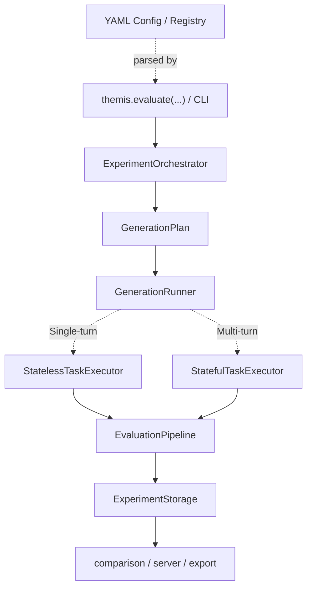
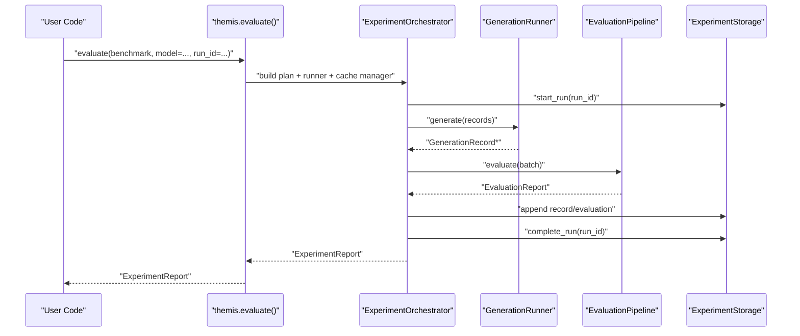
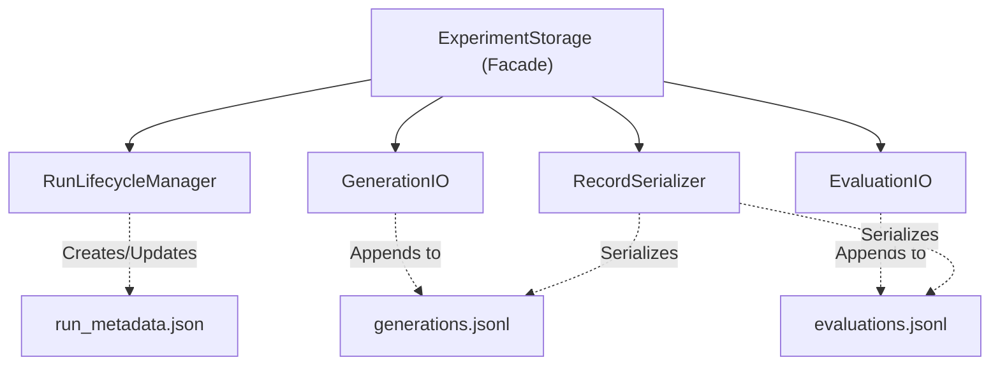

# Architecture Overview

Themis has a public evaluation surface built on a layered orchestration core, supporting both declarative YAML configs and programmatic Python execution:

- `themis.evaluate(...)`: high-level programmatic API for benchmark workflows.
- `themis.config.ExperimentConfig`: YAML-backed registry parser for no-code declarations.

## Layered Design

## Run Lifecycle

## Primary Components

### Public API Layer
- `themis.api.evaluate`: resolves presets, metrics, storage and runs the orchestrator.
- `themis.cli.main`: `demo`, `eval`, `compare`, `share`, `serve`, `list`, `clean`.
- `themis.config.ExperimentConfig`: loads YAML definitions using Hydra.

### Orchestration Layer
- `themis.experiment.orchestrator.ExperimentOrchestrator`: drives the generation + evaluation loop.
- `themis.experiment.cache_manager.CacheManager`: handles run caching and resumption.

### Generation + Evaluation Layer
- `themis.generation.GenerationPlan`: expands dataset into tasks.
- `themis.generation.GenerationRunner`: executes tasks against providers.
- `themis.interfaces.StatelessTaskExecutor`: standard single-turn text generation tasks.
- `themis.interfaces.StatefulTaskExecutor`: complex multi-turn or agentic generation tasks.
- `themis.evaluation.EvaluationPipelineContract`: enforced evaluation interface.
- `themis.evaluation.EvaluationPipeline` / `EvaluationPipeline`: standard metric execution.

### Persistence + Analysis Layer
- `themis.storage.ExperimentStorage`: filesystem-backed run storage.
- `themis.experiment.comparison.compare_runs`: statistical run-to-run comparison.
- `themis.experiment.export`: CSV/JSON/HTML export utilities.
- `themis.server.create_app`: REST/WebSocket API over run artifacts.

## Storage Internals

The `ExperimentStorage` acts as a facade over several highly-focused modules responsible for distinct storage concerns. This adheres to the Single Responsibility Principle and simplifies overriding specific storage behaviors.

## Data Contracts

- Generation outputs are represented by `GenerationRecord`.
- Evaluation outputs are represented by `EvaluationRecord` where `scores` is `list[MetricScore]`.
- Run-level output is `ExperimentReport`.

This canonical shape is used consistently by storage, comparison, exports, and server endpoints.

## Model Routing Contract

- Recommended model key format: `provider:model_id` (for example `litellm:gpt-4`).
- High-level `evaluate(...)` also accepts provider-auto-detected model strings (for example `gpt-4`).

## Extension Points

- Metrics: `themis.register_metric(name, metric_cls)`
- Datasets: `themis.register_dataset(name, factory)`
- Providers: `themis.register_provider(name, factory)`
- Benchmarks: `themis.register_benchmark(preset)`
- Backends: custom `ExecutionBackend` and `StorageBackend`

## Current Trade-offs

- Distributed/custom execution requires an explicit `execution_backend` implementation.
- `themis eval ...` supports benchmark names and custom dataset files (`.json` / `.jsonl`) with field validation.
- Custom storage backends must be ExperimentStorage-compatible for full session integration.
