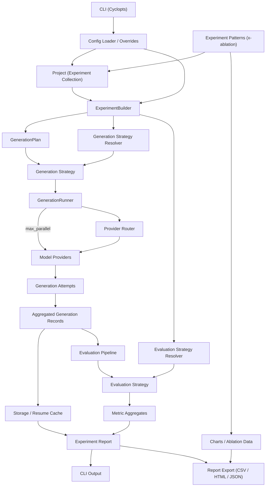

# Experiment Data Flow

Projects now sit between configuration and experiment assembly so multiple experiments (or pattern-generated variants) can share metadata and storage settings. Pattern helpers such as `XAblationPattern` feed both project registration and chart payloads that render in the HTML export. The `Report Export` node illustrates the bundled CSV/HTML/JSON outputs that CLIs can emit after any run.
