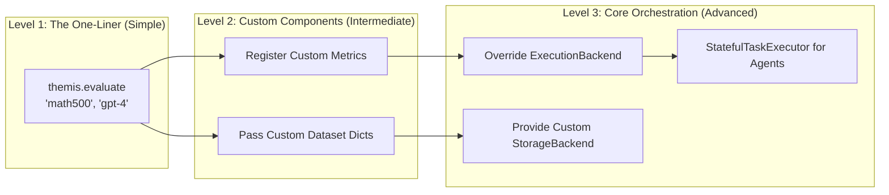

# Themis Design Philosophy

Themis was created to solve the friction LLM researchers face when moving from quick prototype scripts to rigorous, large-scale evaluations. While many evaluation frameworks force researchers into rigid declarative configurations or hide too much underlying complexity, Themis is built on three core tenets.

---

## 1. Every Experiment is Unique

In LLM research, an "evaluation" is rarely just running a static test set against a static model. Researchers constantly tweak:
*   **Prompts:** Testing zero-shot, few-shot, Chain-of-Thought, or custom persona instructions.
*   **Generation Parameters:** Adjusting temperature, top-p, and max tokens.
*   **Metrics:** Combining standard exact match with custom LLM-as-a-judge scorecards.
*   **Models:** Testing a specific checkpoint, a specific quantization, or a specific LoRA adapter.

Because of this, **Themis treats every run as a strictly unique and irreproducible event unless its exact DNA is captured.** 

This principle is enforced aggressively through the `ExperimentOrchestrator` and the generation of an immutable **Reproducibility Manifest**.

```mermaid
flowchart TD
    A[evaluate() Call] --> B[ExperimentOrchestrator]
    B --> C{Reproducibility Manifest}
    C --> |Captures| D[Model & Provider Specs]
    C --> |Captures| E[Generation Config: Temp, Top-P, Seeds]
    C --> |Hashes| F[Dataset Fingerprint]
    C --> |Hashes| G[Prompt Template Hash]
    C --> H[Evaluation Pipeline Signature]
    
    C --> I[(ExperimentStorage)]
    I --> J[Run ID: run-2024-05-12-a1b2c3]
```

By assigning this manifest to a specific `run_id`, researchers can definitively state *exactly* what constituted an experiment months after it was run, preventing the "which script generated these results?" problem.

---

## 2. Define Everything in Code

Many frameworks require complex YAML files for every new parameter combination. Themis believes the best place for an LLM researcher to define experiment logic is **directly in the execution code**. 

Defining experiments in Python ensures that:
1.  **Customization is localized:** You don't jump between 3 config files just to add a new dataset.
2.  **Logic is programmable:** You can use loops, conditionals, and standard Python debugging to orchestrate complex evaluations.
3.  **Reproducibility is explicit:** The script *is* the record of what was done.

### Example: Code-First Configuration

Instead of a static registry requiring a global configuration file, Themis allows injecting custom datasets and prompts directly at the point of evaluation:

```python
import themis

# A custom dataset defined in code
custom_dataset = [
    {"id": "1", "question": "What is 2+2?", "reference": "4"},
    {"id": "2", "question": "What is the capital of France?", "reference": "Paris"}
]

# The setup, the prompt, and the metrics are all defined right here.
report = themis.evaluate(
    dataset=custom_dataset,
    model="gpt-4-turbo",
    prompt="You are a strict teacher. Answer this question concisely: {question}",
    metrics=["exact_match", "bleu"],
    temperature=0.0
)
```

---

## 3. Gradually Exposing Complexity, Highly Customizable

A framework should not require a 10-page tutorial just to run a standard benchmark, but it shouldn't hit a wall when a researcher needs to do something highly non-standard.

Themis achieves this by **layering abstractions**. 

The top layer (`themis.evaluate`) handles 90% of use cases seamlessly. But beneath it lies a layered architecture where any component can be cleanly replaced by an extended class without rewriting the whole pipeline.



### Example: Scaling Complexity

**Level 1: Just get a simple result**
```python
# No setup required.
themis.evaluate("gsm8k", model="claude-3-opus")
```

**Level 2: Tweaking the engine**
```python
# Changing parameters, but still using standard paths
themis.evaluate(
    "gsm8k", 
    model="claude-3-opus",
    workers=32,          # Increase concurrency
    num_samples=5        # Run Pass@5 instead of Pass@1
)
```

**Level 3: Replacing the chassis**
```python
from themis.backends import RayExecutionBackend
from my_custom_storage import PostgresStorageBackend

# Replacing core infrastructure without changing the evaluation logic
themis.evaluate(
    "gsm8k",
    model="claude-3-opus",
    execution_backend=RayExecutionBackend(num_cpus=128),
    storage_backend=PostgresStorageBackend("postgresql://...")
)
```

This ensures researchers only interact with the complexity required for their specific problem, leaving the rest of the orchestration safely abstracted.
