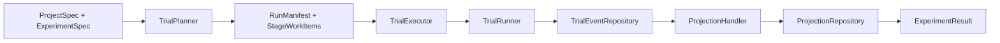

# Architecture

Themis separates execution concerns into small components with clear ownership.

## Responsibilities

| Component | Responsibility |
| --- | --- |
| `TrialPlanner` | Deterministic trial expansion, item sampling, plugin validation |
| `TrialExecutor` | Resume checks, retry behavior, circuit breaker, projection refresh |
| `TrialRunner` | Event emission and per-trial execution |
| Candidate pipeline | Inference, extraction, and metric scoring for one candidate |
| `TrialEventRepository` | Append-only source of truth for lifecycle events |
| `RunManifestRepository` | Persists planned run snapshots and normalized stage work items |
| `ProjectionHandler` | Builds read models when a trial reaches a terminal state |
| `ProjectionRepository` | Reads `TrialRecord`, timeline views, and score rows |
| `Orchestrator` | Convenience facade over the full write path |

## High-Level Flow

`Orchestrator.plan()` snapshots the resolved experiment into a `RunManifest`
before execution or external handoff. That manifest records the canonical
project/experiment specs, deterministic trial hashes, and stage work items for
generation, transforms, and evaluations.

## Why The Event Log Matters

The event repository is the write-side source of truth. Everything else is
derived from it:

- trial summaries
- candidate summaries
- metric score tables
- record timelines
- hydrated `TrialRecord` projections

That design makes resume, replay, and projection refresh explicit instead of
burying them inside ad hoc caches.

Run manifests sit beside the event log rather than replacing it. They track
which work items are pending or already completed, but the append-only trial
events remain the source of truth for replay and projection hydration.

## Public Namespaces

The root `themis` package stays intentionally small. Supporting namespaces are
thin re-export layers over stable lower-level models:

- `themis.records` exposes persisted record models used by projections, reports,
  and timelines
- `themis.types` exposes shared enums plus event/value types used across the
  runtime
- `themis.stats` exposes paired-comparison helpers behind the optional `stats`
  extra

Those namespaces stay lazy-loaded so optional dependency boundaries and base
import cost remain stable.
