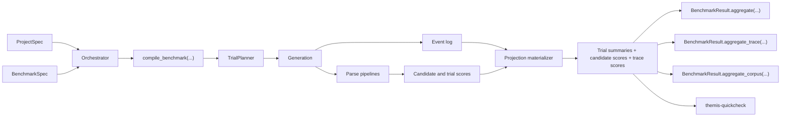

# Architecture

Themis compiles one public benchmark model into a private execution plan, runs
that plan, then serves read APIs from projection tables instead of re-deriving
results on every query.

## Design Consequences

- benchmark semantics are persisted, not reconstructed from `task_id`
- slice-level prompt applicability is explicit, not a blind cross product
- dataset providers own query pushdown
- parse pipelines are separate from scoring
- candidate, trace, and corpus analysis read from the same persisted benchmark fields such as `slice_id`, `prompt_variant_id`, and dimensions
- trace metrics score persisted trial or candidate traces after materialization, so workflow checks do not require a second inference pass
