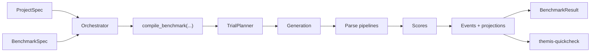

# Architecture

Themis compiles one public benchmark model into a private execution plan, runs
that plan, then exposes projection-backed result APIs.

## Design Consequences

- benchmark semantics are persisted, not reconstructed from `task_id`
- slice-level prompt applicability is explicit, not a blind cross product
- dataset providers own query pushdown
- parse pipelines are separate from scoring
- aggregation is based on benchmark fields like `slice_id`, `prompt_variant_id`, and dimensions
