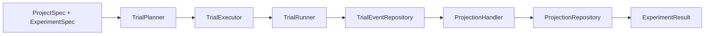

# Architecture

Themis separates execution concerns into small components with clear ownership.

## Responsibilities

| Component | Responsibility |
| --- | --- |
| `TrialPlanner` | Deterministic trial expansion, item sampling, compatibility validation |
| `TrialExecutor` | Resume checks, retry behavior, circuit breaker, projection refresh |
| `TrialRunner` | Event emission and per-trial execution |
| Candidate pipeline | Inference, extraction, and metric scoring for one candidate |
| `TrialEventRepository` | Append-only source of truth for lifecycle events |
| `ProjectionHandler` | Builds read models when a trial reaches a terminal state |
| `ProjectionRepository` | Reads `TrialRecord`, timeline views, and score rows |
| `Orchestrator` | Convenience facade over the full write path |

## High-Level Flow

## Why The Event Log Matters

The event repository is the write-side source of truth. Everything else is
derived from it:

- trial summaries
- candidate summaries
- metric score tables
- record timelines
- hydrated `TrialRecord` projections

That design makes resume, replay, and projection refresh explicit instead of
burying them inside ad hoc caches.
