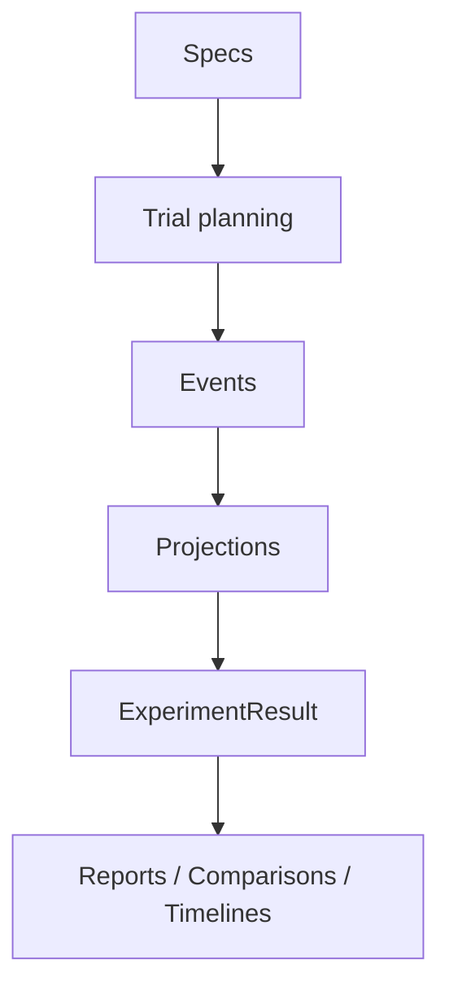

# Concepts

Themis is easiest to understand if you keep three mental models in view:

1. Specs describe what should happen.
2. Events record what did happen.
3. Projections make those events easy to query after the run.

## Read This Section For

- architecture and component boundaries
- the difference between specs, runtime context, and records
- storage layout and resume behavior
- how plugins and hooks fit into execution

## Concept Map

