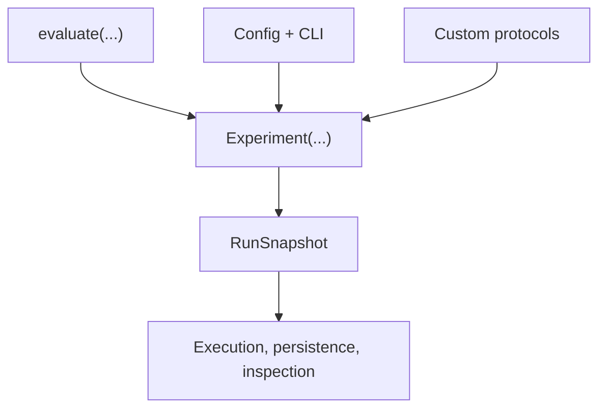

# API layer model

What it is: the layered user-facing surface that starts with `evaluate(...)`, centers on `Experiment(...)`, and expands to custom protocols.

When it matters: whenever you are choosing an entry point or documenting a workflow for another user.

What you provide: the smallest layer that expresses the task cleanly.

What Themis provides: compatibility between layers because they all compile to the same snapshot-centric runtime model.

This diagram shows the layers as progressively more explicit authoring surfaces over one shared runtime.

The important point is that the user-facing surfaces differ, but the compiled artifact and execution model do not.

What to inspect when it goes wrong: inspect whether the chosen layer is hiding decisions you now need to make explicit.
