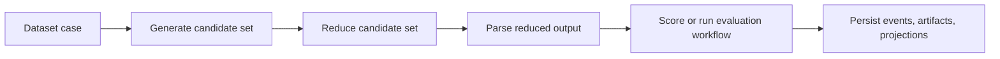

# Case lifecycle

What it is: the path one case takes from dataset input to final score rows and persisted artifacts.

When it matters: whenever you need to understand where data changes shape or where a failure occurred.

What you provide: a case inside a dataset, generation config, evaluation config, and optional seeds.

What Themis provides: planning, candidate fan-out, optional reduction, optional parsing, scoring, persistence, and projection refresh.

Use this lifecycle map when you need to localize where one case changed shape or failed.

Each box is a distinct inspection boundary, which is why failures are easier to localize than in a monolithic run loop.

What to inspect when it goes wrong: generated candidates, reduced candidate output, parsed output, evaluation executions, and projection-backed reports.
