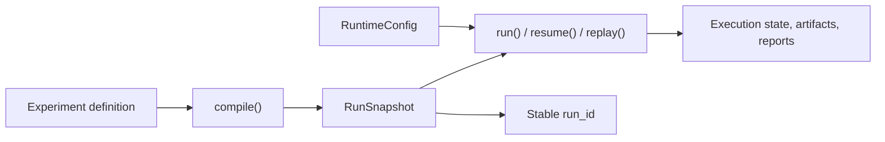

# Compile vs run

What it is: the boundary between creating a `RunSnapshot` and executing it.

When it matters: whenever you need to reason about `run_id`, resume semantics, or runtime tuning.

What you provide: compile-time experiment inputs plus optional runtime overrides at execution time.

What Themis provides: immutable snapshot compilation and orchestrated execution over that snapshot.

Use this boundary map when it is unclear whether a setting freezes the run or only changes execution behavior.

Compilation decides what the run is, while execution decides how that frozen run is carried out.

What to inspect when it goes wrong: inspect the compiled snapshot first, then inspect execution state, stored events, and runtime settings.
