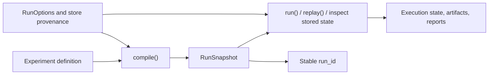

# Compile vs run

What it is: the boundary between creating a `RunSnapshot` and executing it.

When it matters: whenever you need to reason about `run_id`, resume semantics, or runtime tuning.

What you provide: experiment inputs plus an optional store and `RunOptions` at
the compile or execution boundary.

What Themis provides: immutable snapshot compilation and orchestrated execution over that snapshot.

Use this boundary map when it is unclear whether a setting freezes the run or only changes execution behavior.

```mermaid
flowchart LR
    A["Experiment definition"] --> B["compile()"]
    E["RunOptions and store provenance"] --> B
    B --> C["RunSnapshot"]
    C --> D["run() / replay() / inspect stored state"]
    E --> D
    C --> F["Stable run_id"]
    D --> G["Execution state, artifacts, reports"]
```

Compilation freezes logical identity and execution provenance. `run()` uses the
same compilation path, so compiling and executing with the same store and
options produce the same snapshot. Runtime settings affect provenance but not
the logical `run_id`.

What to inspect when it goes wrong: inspect the compiled snapshot first, then inspect execution state, stored events, and runtime settings.
