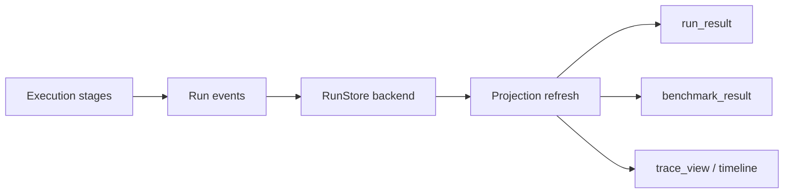

# Events, stores, and read models

What it is: the persistence model that records run events and derives projections such as run results, benchmark results, timeline views, and trace views.

When it matters: whenever you resume a run, export a report, or inspect artifacts after the original process exits.

What you provide: a store backend and any store-specific configuration.

What Themis provides: event emission, projection refresh, resume support, and reporting helpers.

This diagram shows the write side and read side as separate but connected concerns.

The store preserves what happened, and the read models turn that durable event history into faster inspection surfaces.

What to inspect when it goes wrong: raw stored runs first, then derived projections such as `run_result`, `benchmark_result`, and `trace_view`.
