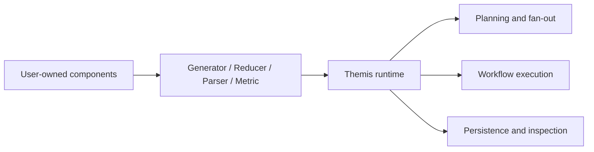

# Extension boundaries

What it is: the line between user-owned components and Themis-owned orchestration.

When it matters: whenever a custom component starts to replicate planning, persistence, or workflow execution logic that the runtime already provides.

What you provide: protocol-conforming components with stable identity and focused behavior.

What Themis provides: orchestration, fan-out, evaluation workflows, persistence, and projection-backed inspection.

Use this ownership map when a custom component starts to feel broader than one protocol boundary.

Custom components should supply behavior at one boundary, not absorb orchestration responsibilities that belong to the runtime.

What to inspect when it goes wrong: check whether the custom component is trying to own orchestration concerns that belong in Themis.
