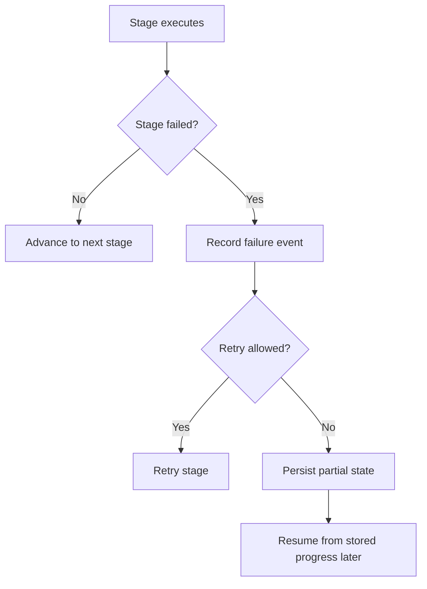

# Failure, retry, and resume

What it is: the user-facing behavior for partial failures, retryable persistence, and continuing interrupted work.

When it matters: whenever a provider call, parsing step, scoring step, or persistence action fails.

What you provide: runtime retry settings and a store that persists enough state to resume.

What Themis provides: failure events, structured retry metadata, duplicate-run handling, and per-stage resume behavior.

Use this flow to reason about whether the next action is retrying a stage or continuing from stored state.

Retry is a same-stage recovery decision, while resume is a later continuation decision over persisted state.

Important distinctions:

- retry history explains transient recovery inside one stage execution
- `existing_run_policy` explains what happens when you submit the same compiled `run_id` again
- `completed_through_stage` explains whether a run intentionally stopped at `generate`, `reduce`, `parse`, `score`, or `judge`
- resume continues unfinished persisted work
- replay re-runs downstream stages from stored upstream artifacts

Retry classification is built around common endpoint failures: explicit retryable exceptions, timeouts, connection failures, `429` rate limits, and `5xx` server failures. Persisted retry history includes the attempt number, delay, reason, and any `retry_after_s` hint that the provider returned.

What to inspect when it goes wrong: stage-specific failures inside execution state, evaluation failures, retry history on generation or judge calls, and runtime retry settings.
