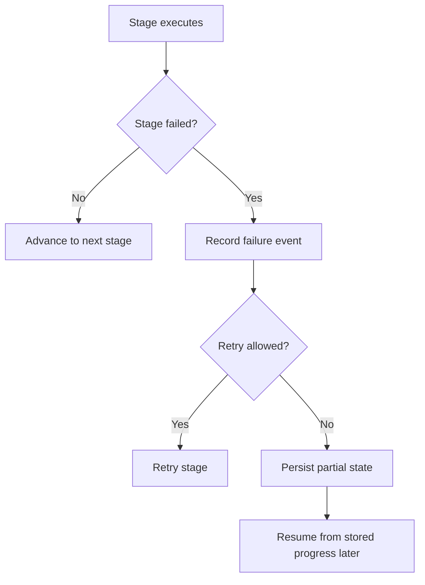

# Failure, retry, and resume

What it is: the user-facing behavior for partial failures, retryable persistence, and continuing interrupted work.

When it matters: whenever a provider call, parsing step, scoring step, or persistence action fails.

What you provide: runtime retry settings and a store that persists enough state to resume.

What Themis provides: failure events, partial-failure status handling, and per-stage resume behavior.

Use this flow to reason about whether the next action is retrying a stage or continuing from stored state.

Retry is a same-stage recovery decision, while resume is a later continuation decision over persisted state.

What to inspect when it goes wrong: stage-specific failures inside execution state, evaluation failures, and runtime retry settings.
