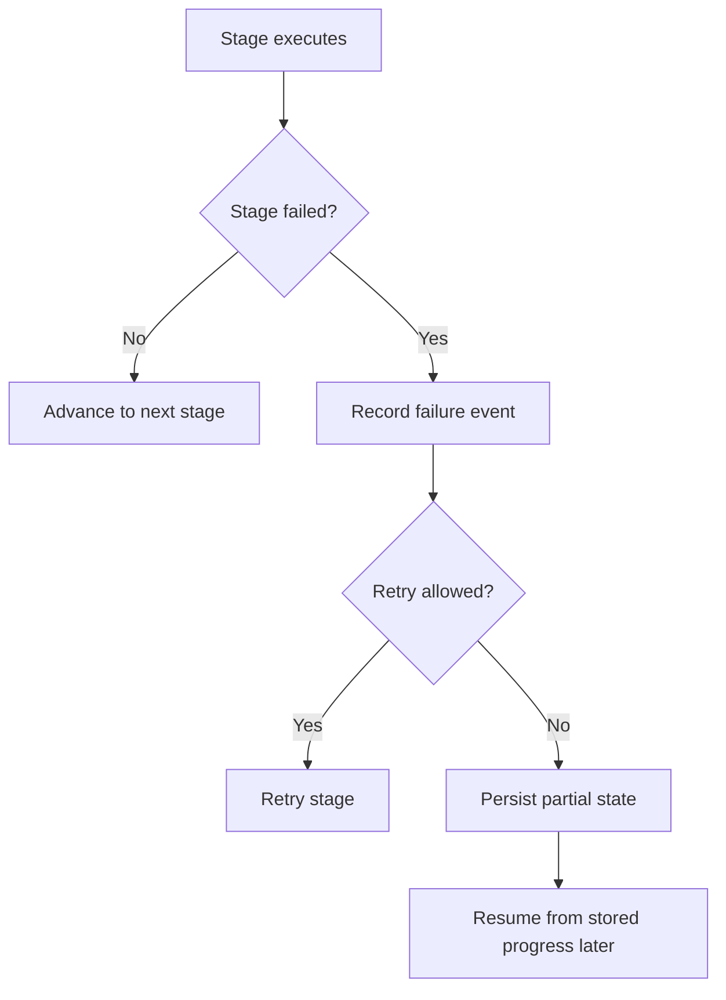

# Failure, retry, and resume

What it is: the user-facing behavior for partial failures, retryable persistence, and continuing interrupted work.

When it matters: whenever a provider call, parsing step, scoring step, or persistence action fails.

What you provide: runtime retry settings and a store that persists enough state to resume.

What Themis provides: failure events, structured retry metadata, duplicate-run handling, and per-stage resume behavior.

Events have stable IDs and per-run sequences, so retrying an append cannot
duplicate logical evidence. Failures include a stable code, exception class,
stage, component, retryability, and attempt identity. Sanitized traceback blobs
are retained under `standard` and `full` policies.

Use this flow to reason about whether the next action is retrying a stage or continuing from stored state.

```mermaid
flowchart TD
    A["Stage executes"] --> B{"Stage failed?"}
    B -->|No| C["Advance to next stage"]
    B -->|Yes| D["Record failure event"]
    D --> E{"Retry allowed?"}
    E -->|Yes| F["Retry stage"]
    E -->|No| G["Persist partial state"]
    G --> H["Resume from stored progress later"]
```

Retry is a same-stage recovery decision, while resume is a later continuation decision over persisted state.

Important distinctions:

- retry history explains transient recovery inside one stage execution
- `existing_run_policy` explains what happens when you submit the same compiled `run_id` again
- `completed_through_stage` explains whether a run intentionally stopped at `generate`, `reduce`, `parse`, `score`, or `judge`
- `themis resume` reopens stored status; `run()` with `existing_run_policy="reuse"` continues unfinished persisted work
- replay re-runs downstream stages from stored upstream artifacts
- rerun targets failed cases, case slices, or metric subsets while preserving the compiled run identity

Resume uses store-level execution checkpoints when they are fresh. The event stream remains authoritative for audit and recovery, so older stores or stale checkpoints can still rebuild state by replaying stored events.

Each initial run, replay, or rerun has an `attempt_id`. Resume continues
the active attempt; new downstream work creates a child attempt, preserving
earlier score claims for history inspection. Unsupported schema-v1 development
stores must be archived or recreated.

Retry classification is built around common endpoint failures: explicit retryable exceptions, timeouts, connection failures, `429` rate limits, and `5xx` server failures. Persisted retry history includes the attempt number, delay, reason, and any `retry_after_s` hint that the provider returned.

What to inspect when it goes wrong: stage-specific failures inside execution state, evaluation failures, retry history on generation or judge calls, and runtime retry settings.
