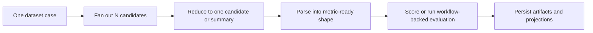

# Fan-out, reduction, parsing, and scoring

What it is: the staged model that separates candidate multiplicity, reduced-candidate selection, output normalization, and final scoring.

When it matters: whenever `num_samples` is greater than one or metrics need a parsed shape that differs from raw model output.

What you provide: candidate policy, optional reducer, optional parser, and metrics.

What Themis provides: ordered stage execution, typed contexts, and persisted artifacts between stages.

Use this pipeline when you need to see exactly where the output changes shape.

Each stage exists so multiplicity, selection, normalization, and scoring can evolve independently without collapsing into one overloaded component.

What to inspect when it goes wrong: generated candidates first, then reduction output, then parsed output, then scores or evaluation executions.
