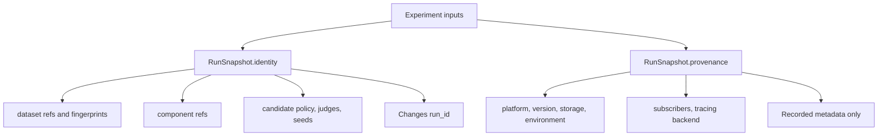

# Identity vs provenance

What it is: the split between logical run inputs and execution metadata.

When it matters: whenever a `run_id` changes unexpectedly or stays the same when you expected a new logical run.

What you provide: identity-bearing inputs such as dataset refs, component refs, candidate policy, judge config, workflow overrides, and seeds.

What Themis provides: provenance capture for version, platform, runtime, storage, environment metadata, and runtime-only execution wiring such as tracing or subscribers.

Use this split when you need to explain why two runs are logically the same or different.

If the logical run changed, the difference should appear on the identity side; provenance explains where and how that same logical run happened. Changing a `LifecycleSubscriber` or `TracingProvider` changes runtime observation, not logical run identity.

What to inspect when it goes wrong: look at `RunSnapshot.identity` first. If the logical run should be the same, differences should only appear in `RunSnapshot.provenance`.
