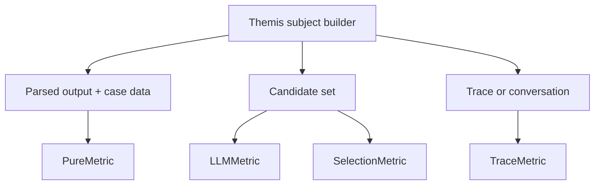

# Metric families and subjects

What it is: the relationship between metric families and the subjects they consume.

When it matters: whenever you are choosing a metric type or trying to understand why a workflow expects a candidate set, trace, or conversation instead of just parsed output.

What you provide:

- pure metrics consume parsed output and case data
- LLM metrics consume candidate-set subjects
- selection metrics consume candidate-set subjects for pairwise or ranked comparisons
- trace metrics consume trace or conversation subjects

What Themis provides: subject construction, workflow execution, persistence, and artifact inspection.

Use this map when the metric family seems right but the evidence shape does not.

Metric families are mostly distinguished by the subject shape they need, not just by how they compute the final score.

What to inspect when it goes wrong: verify that the subject type and metric family match the kind of evidence you want the runtime to score.
