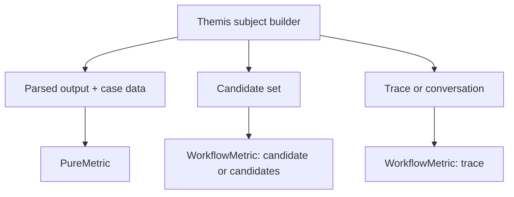

# Metric families and subjects

What it is: the relationship between metric families and the subjects they consume.

When it matters: whenever you are choosing a metric type or trying to understand why a workflow expects a candidate set, trace, or conversation instead of just parsed output.

What you provide:

- pure metrics consume parsed output and case data
- workflow metrics declare `subject_kind` as `candidate`, `candidates`, or `trace`

What Themis provides: subject construction, workflow execution, persistence, and artifact inspection.

Every metric also declares a `MetricInterpretation`. Its direction and optional
valid range are part of run identity. A correctness threshold is optional:
metrics with one report `correct` or `incorrect`; continuous, calibration,
agreement, ranking, and preference metrics without one report `scored`. Neutral
metrics cannot declare a correctness threshold, and out-of-range or missing
numeric values are reported as structured metric failures.

Use this map when the metric family seems right but the evidence shape does not.

```mermaid
flowchart TD
    A["Themis subject builder"] --> B["Parsed output + case data"]
    A --> C["Candidate set"]
    A --> D["Trace or conversation"]
    B --> E["PureMetric"]
    C --> F["WorkflowMetric: candidate or candidates"]
    D --> H["WorkflowMetric: trace"]
```

Metric families are mostly distinguished by the subject shape they need, not just by how they compute the final score.

What to inspect when it goes wrong: verify that the subject type and metric family match the kind of evidence you want the runtime to score.
