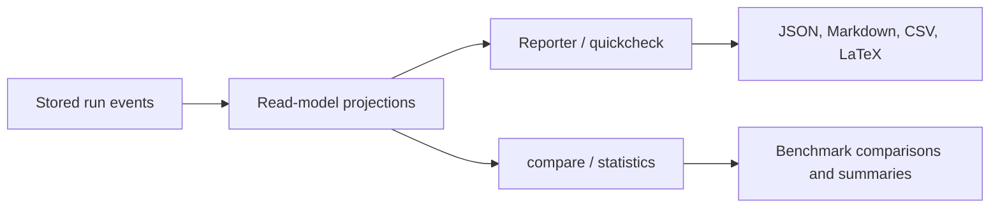

# Reporting and read models

What it is: the read-side model that turns stored events into benchmark summaries, score tables, timelines, and trace views.

When it matters: whenever you use `Reporter`, `quickcheck`, or comparison/statistics helpers instead of inspecting raw events directly.

What you provide: a stored run and any format-specific export choice.

What Themis provides: projection-backed reporting and statistics over those projections.

Use this flow when you need to understand how a stored run becomes a report instead of a raw event log.

Reporting helpers do not bypass persistence; they sit on top of projection-backed read models derived from stored events.

What to inspect when it goes wrong: compare the raw stored run with the benchmark and trace projections to determine whether the issue is in execution or in derived reporting.
