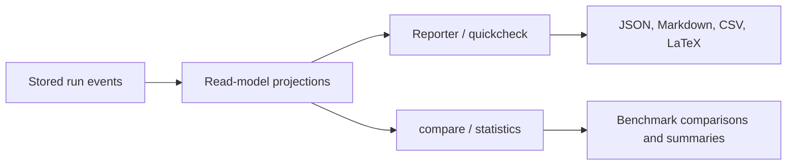

# Reporting and read models

What it is: the read-side model that turns stored events into benchmark summaries, score tables, timelines, and trace views.

When it matters: whenever you use `Reporter`, `quickcheck`, or comparison/statistics helpers instead of inspecting raw events directly.

What you provide: a stored run and any format-specific export choice.

What Themis provides: projection-backed reporting and statistics over those projections.

Use this flow when you need to understand how a stored run becomes a report instead of a raw event log.

Reporting helpers do not bypass persistence; they sit on top of projection-backed read models derived from stored events.

Benchmark projections now separate scored outcomes from pipeline errors:

- successful scored rows are labeled `correct` or `incorrect`
- pipeline problems produce `error` rows with `error_category` and `error_message`
- metric means are computed only from scored rows, not from error rows
- per-metric `outcome_counts` and `error_counts` make it possible to distinguish model quality from parser, evaluator, or workflow instability

This is the intended export boundary for external reporting. Use `benchmark_result` and `Reporter.export_csv(...)` when you want to build leaderboards, prompt sweep comparisons, or warehouse-backed dashboards outside Themis.

The important semantic boundary is:

- `correct` and `incorrect` mean the metric produced a usable score
- `error` means the pipeline failed before a usable score existed

That distinction is why `error_counts` and `outcome_counts` are the intended downstream analysis surface for failure-mode tracking, parser debugging, and qualitative tagging built on top of custom metric `details`.

What to inspect when it goes wrong: compare the raw stored run with the benchmark and trace projections to determine whether the issue is in execution or in derived reporting.
