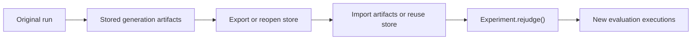

# Reproducibility and rejudge

What it is: the model for reproducing a run from stored artifacts and re-running workflow-backed metrics without regenerating candidates.

When it matters: whenever generation should remain fixed but evaluation needs to move or be rerun.

What you provide: stored upstream artifacts and, for memory-backed runs, the original store instance.

What Themis provides: generation/evaluation bundles and `Experiment.rejudge()`.

Use this flow when evaluation must move forward while generation stays frozen.

Rejudge works because the upstream generation evidence stays fixed, so only the evaluation side is rerun.

What to inspect when it goes wrong: verify snapshot identity first, then confirm stored upstream artifacts exist, then inspect the rerun evaluation executions.
