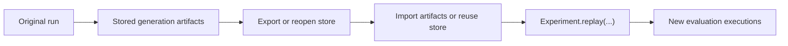

# Reproducibility and replay

What it is: the model for reproducing a run from stored artifacts and replaying downstream stages without regenerating candidates.

When it matters: whenever generation should remain fixed but evaluation needs to move or be rerun.

What you provide: stored upstream artifacts and, for memory-backed runs, the original store instance.

What Themis provides: stage-specific bundles plus `Experiment.replay()`.

Use this flow when evaluation must move forward while generation stays frozen.

```mermaid
flowchart LR
    A["Original run"] --> B["Stored generation artifacts"]
    B --> C["Export or reopen store"]
    C --> D["Import artifacts or reuse store"]
    D --> E["Experiment.replay(...)"]
    E --> F["New evaluation executions"]
```

Replay works because the upstream generation evidence stays fixed, so only the requested downstream stages are rerun. Use `Experiment.replay(from_stage=Stage.JUDGE)` to rerun workflow-backed judging without regenerating candidates.

What to inspect when it goes wrong: verify snapshot identity first, then confirm stored upstream artifacts exist, then inspect the rerun evaluation executions.
