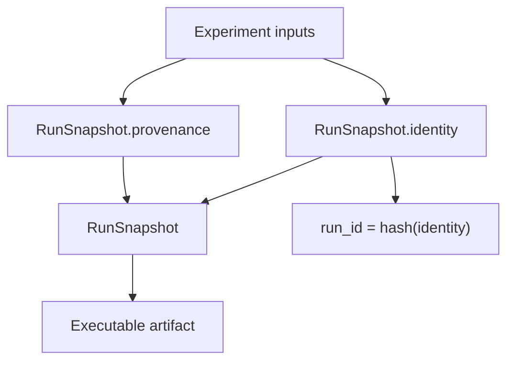

# `RunSnapshot`

What it is: the immutable executable artifact compiled from an experiment definition.

When it matters: whenever you care about reproducibility, `run_id`, or what exactly was frozen before execution started.

What you provide: datasets, component refs, candidate policy, judge configuration, workflow overrides, seeds, storage config, runtime config, and provenance metadata.

What Themis provides: a stable `run_id`, frozen identity, and a durable record of what the run means versus where it happened.

Use this snapshot map when you need to separate logical run identity from execution context.

The snapshot is the frozen contract for execution, and only its identity side participates in the `run_id`.

What to inspect when it goes wrong: compare `RunSnapshot.identity` when `run_id` changes and `RunSnapshot.provenance` when the run is logically the same but the environment differs.
