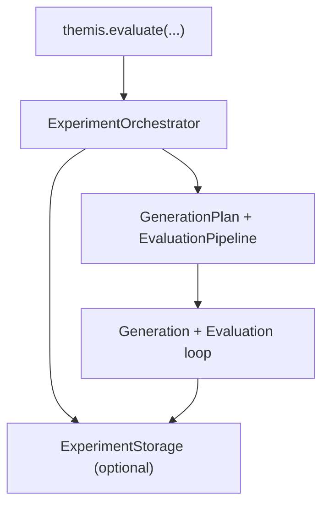
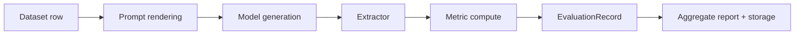

# Core Concepts

Understanding the key concepts in Themis will help you use it effectively.

## Architecture Overview

Themis is built on a layered architecture:



At runtime, each sample goes through a generation/evaluation loop:



## Key Concepts

### 1. Evaluation

**Evaluation** is the process of testing an LLM on a dataset and computing metrics.

```python
from themis import evaluate

report = evaluate(
    "gsm8k",
    model="gpt-4",
    metrics=["exact_match"],
)

accuracy = report.evaluation_report.metrics["ExactMatch"].mean
```

**Three steps:**
1. **Generation**: LLM produces responses
2. **Evaluation**: Metrics compare responses to references
3. **Reporting**: Results are aggregated and stored

### 2. Benchmarks & Presets

**Benchmarks** are standardized evaluation datasets with:
- Prompts/questions
- Reference answers
- Evaluation metrics
- Prompt templates

**Presets** package these into ready-to-use configurations:

```python
evaluate("gsm8k", model="gpt-4")
evaluate("mmlu-pro", model="gpt-4")
evaluate("aime24", model="gpt-4")
```

Each preset includes:
- Dataset loader
- Default prompt template
- Appropriate metrics
- Reference field mapping

### 3. Metrics

**Metrics** quantify how well an LLM performs:

**Core Metrics:**
- `ExactMatch` - Exact string matching
- `ResponseLength` - Length-based signal

**Math Metrics:**
- `MathVerifyAccuracy` - Symbolic & numeric verification

**NLP Metrics:**
- `BLEU`, `ROUGE`, `BERTScore`, `METEOR`

**Code Metrics:**
- `PassAtK`, `ExecutionAccuracy`, `CodeBLEU`

```python
report = evaluate(
    "gsm8k",
    model="gpt-4",
    metrics=["exact_match", "math_verify"],
)

print(report.evaluation_report.metrics)
```

### 4. Storage & Caching

Themis caches results to enable:
- **Resuming failed runs**
- **Avoiding duplicate API calls**
- **Reproducibility**

```python
# First run - generates responses
report1 = evaluate("gsm8k", model="gpt-4", run_id="my-exp")

# Second run - uses cache
report2 = evaluate(
    "gsm8k",
    model="gpt-4",
    run_id="my-exp",
    resume=True,
)
```

Under the hood, caching uses `ExperimentStorage` with a configurable path.

### 5. Comparison

**Comparison** analyzes differences between runs with statistical rigor:

```python
from themis.experiment.comparison import compare_runs

report = compare_runs(
    run_ids=["gpt4-run", "claude-run"],
    storage_path=".cache/experiments",
)

print(report.summary())
```

### 6. Providers

Themis supports both hosted providers (via LiteLLM) and local in-process vLLM:

```python
# OpenAI
evaluate("gsm8k", model="gpt-4")

# Anthropic
evaluate("gsm8k", model="claude-3-opus-20240229")

# Azure OpenAI
evaluate("gsm8k", model="azure/gpt-4")
```

For all provider keys, model string formats, and connection recipes, see
[Providers and Model Connectivity](../guides/providers.md).

### 7. Custom Pipelines

For advanced control you can build a custom `EvaluationPipeline` and pass it
directly to `evaluate()`:

```python
from themis import evaluate
from themis.evaluation.pipeline import EvaluationPipeline
from themis.evaluation import extractors, metrics

pipeline = EvaluationPipeline(
    extractor=extractors.IdentityExtractor(),
    metrics=[metrics.ResponseLength()],
)

report = evaluate(
    "demo",
    model="fake-math-llm",
    evaluation_pipeline=pipeline,
    workers=2,
    storage_path=".cache/experiments",
)
```
