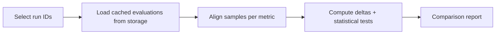
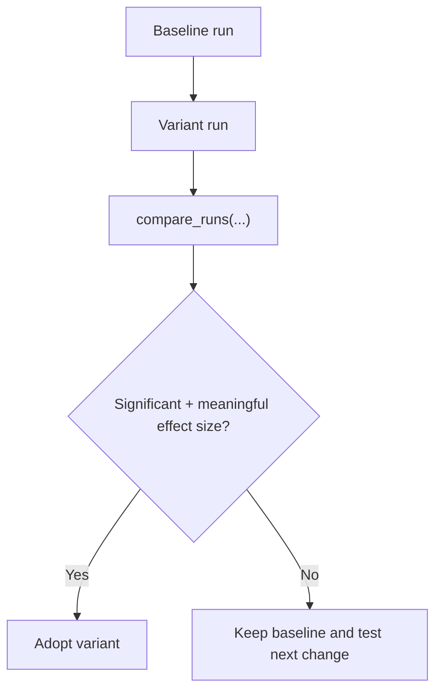

# Comparison Guide

Use `themis.comparison.compare_runs` to compare two or more run IDs.

## Comparison Flow



## Basic

```python
from themis.comparison import compare_runs
from themis.comparison.statistics import StatisticalTest

report = compare_runs(
    run_ids=["run-a", "run-b"],
    storage_path=".cache/experiments",
    statistical_test=StatisticalTest.BOOTSTRAP,
    alpha=0.05,
)

print(report.summary())
```

## What `compare_runs(...)` Produces

- Per-metric winners and deltas
- Pairwise significance results
- Optional multiple-hypothesis correction metadata
- Inputs suitable for HTML/JSON export

## Metric-Scoped Comparison

```python
report = compare_runs(
    run_ids=["run-a", "run-b", "run-c"],
    storage_path=".cache/experiments",
    metrics=["ExactMatch"],
)
```

## Recommended Evaluation Pattern



## CLI

```bash
themis compare run-a run-b --output comparison.html
```

## Interpretation Checklist

- Check effect size (`delta`) before focusing on p-values.
- Prefer metrics that map directly to your task objective.
- Keep run configuration differences narrow (one primary variable at a time).
- Confirm sample alignment assumptions when using paired tests.

## Notes

- Run IDs must exist in the same storage root.
- Metrics compared are the intersection available across selected runs.
