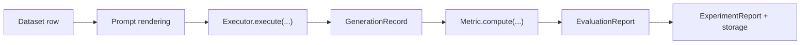
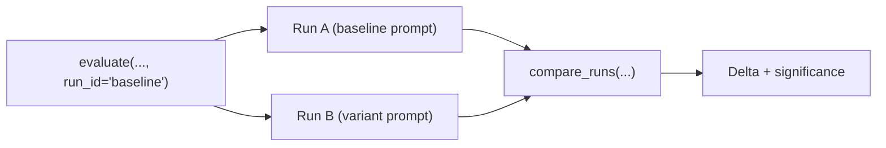
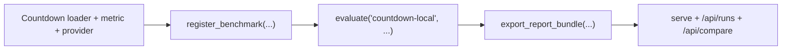
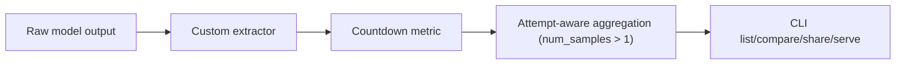
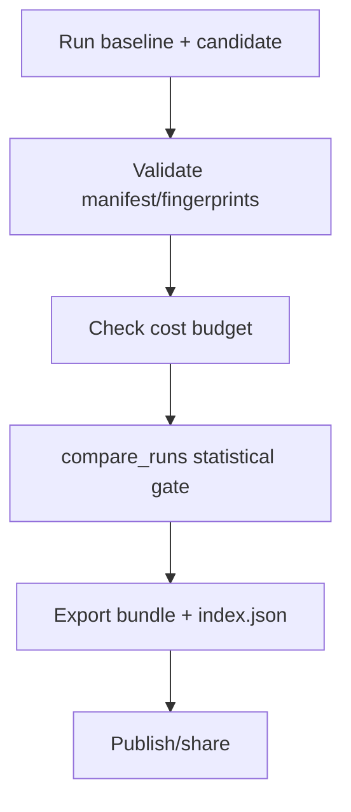
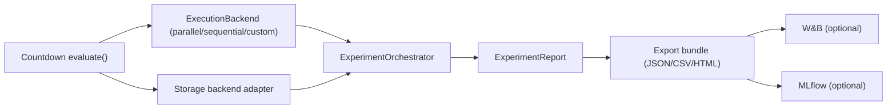
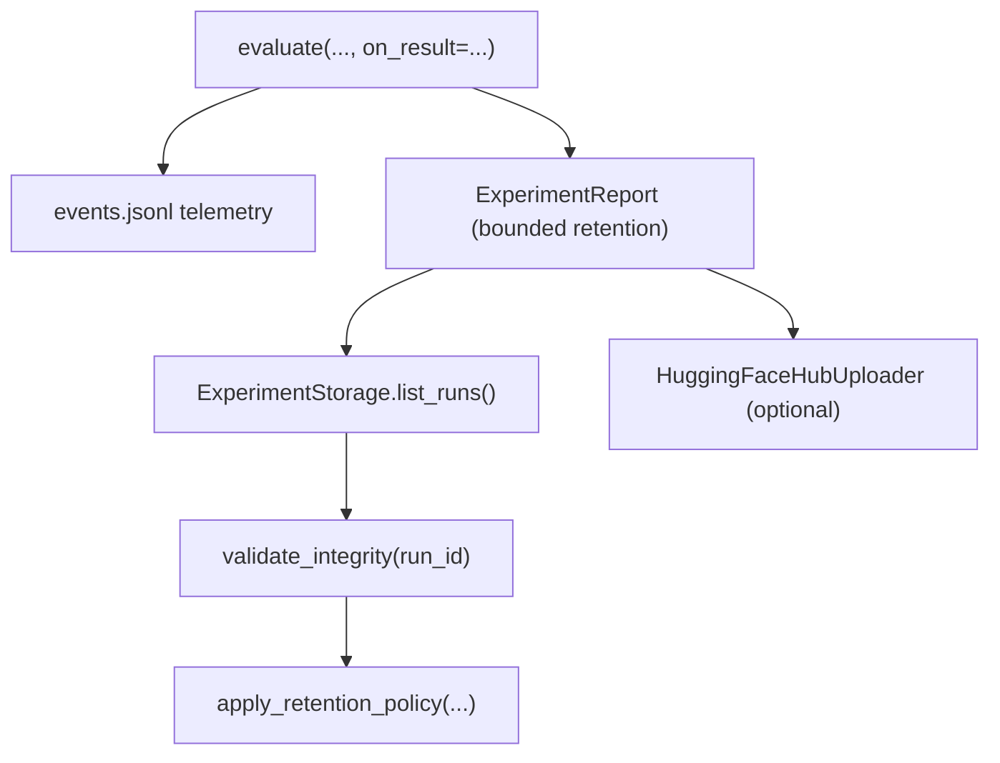
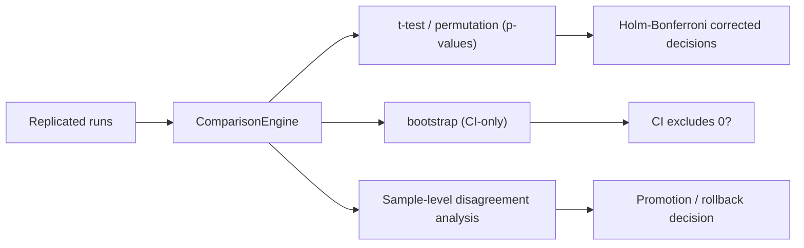
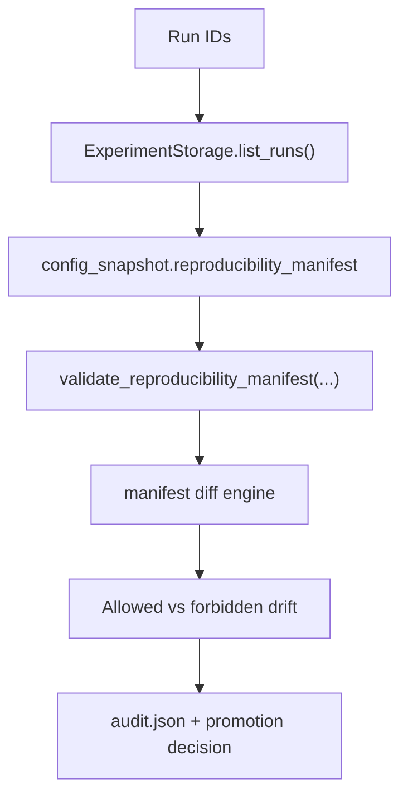

# Countdown Tutorial (Custom Data, Custom Metric, Local LLM)

This tutorial walks through a full Themis experiment for Countdown
(generalized Game 24), including:

- custom data loading from Hugging Face (`predibase/countdown`)
- a custom correctness metric (`CountdownValidity`)
- a custom provider adapter for your local LLM endpoint
- a real experiment run with `themis.evaluate(...)`

This guide is structured as a learning path:

- **Part 1-4**: core experiment concepts + reusable benchmark workflow
- **Part 5-6**: reproducibility gates + backend/publishing integration
- **Part 7-9**: operations, statistical reliability, and provenance audits

## How to Use This Tutorial

- Run all commands from the repository root.
- Reusable scripts live in `examples/countdown/`.
- Each part includes:
  - concept and why it matters
  - runnable commands/code
  - expected outcome
  - links for deeper reading

```mermaid
flowchart LR
    A["Part 1: Custom task + metric + provider"] --> B["Part 2: Session + cache + compare"]
    B --> C["Part 3: Benchmark + export + serve"]
    C --> D["Part 4: Extractor + attempts + CLI"]
    D --> E["Part 5: Reproducibility + quality gates"]
    E --> F["Part 6: Backends + W&B/MLflow"]
    F --> G["Part 7: Operations + retention"]
    G --> H["Part 8: Statistical robustness"]
    H --> I["Part 9: Provenance audits"]
```



## Part Map

| Part | Main concept | Run this |
| --- | --- | --- |
| 1 | Custom task setup | `uv run python examples/countdown/countdown_tutorial_run.py` |
| 2 | Session + resume + compare | Follow inline code in **Part 2** |
| 3 | Benchmark + export + serve | Follow inline code in **Part 3** |
| 4 | Extractor + attempts + CLI ops | Follow inline code in **Part 4** |
| 5 | Reproducibility + release gate | `bash examples/countdown/run_part5_pipeline.sh` |
| 6 | Backend + publication wiring | `uv run python examples/countdown/run_countdown_part6_backends.py` |
| 7 | Observability + storage hygiene | `bash examples/countdown/run_part7_pipeline.sh` |
| 8 | Statistical reliability | `bash examples/countdown/run_part8_pipeline.sh` |
| 9 | Manifest provenance gate | `bash examples/countdown/run_part9_pipeline.sh` |

## Part Requirements

| Part | Internet needed | Local endpoint needed | Typical runtime |
| --- | --- | --- | --- |
| 1 | Yes (dataset download) | Yes | 2-10 min |
| 2 | No (if dataset cached) | Yes | 3-10 min |
| 3 | No (if dataset cached) | Yes | 5-15 min |
| 4 | No (if dataset cached) | Yes | 5-15 min |
| 5 | No (if runs already exist) | Yes (for first baseline/candidate run) | 5-20 min |
| 6 | No (if runs already exist) | Yes | 5-20 min |
| 7 | No (if runs already exist) | Yes | 5-20 min |
| 8 | No (if runs already exist) | Yes | 10-30 min |
| 9 | No | No | 1-5 min |

## Themis Concepts You’ll Use

An experiment in Themis is:

- **dataset rows** (inputs + references)
- **prompt template** (how each row is rendered for the model)
- **model/provider** (where generation happens)
- **metrics** (how correctness is scored)
- **run metadata** (`run_id`, storage path, cache/resume behavior)



## Countdown Rules Modeled

- allowed operators: `+`, `-`, `*`, `/`
- each source number used at most once
- expression must parse and evaluate
- all intermediate values must be positive integers
- final value must equal target

## Local Endpoint Assumption

This tutorial uses your local endpoint shape:

- URL: `http://localhost:1234/api/v1/chat`
- body fields: `model`, `system_prompt`, `input`
- response contains `output` list with a `type="message"` item

## Prerequisites

```bash
uv add themis-eval datasets
```

## Preflight Checks

Before running Parts 1-8, verify required dependencies are reachable:

```bash
# 1) Local provider endpoint
curl -sS http://localhost:1234/api/v1/chat >/dev/null

# 2) Hugging Face dataset connectivity
uv run python - <<'PY'
from datasets import load_dataset
load_dataset("predibase/countdown", split="train[:1]")
print("ok")
PY
```

If either check fails, use `demo`/`examples` workflows first and treat
Countdown Parts 1-8 as optional until your environment is ready.

## End-to-End Script

Use the ready-made script at `examples/countdown/countdown_tutorial_run.py`
(or run inline with `uv run python - <<'PY'`).

```python
from __future__ import annotations

import ast
import json
import re
import urllib.request
from collections import Counter
from dataclasses import dataclass
from typing import Any, Sequence

import themis
from datasets import load_dataset
from themis.core import entities as core
from themis.interfaces import Metric as MetricInterface, StatelessTaskExecutor


# ---------- 1) Custom provider for localhost:1234/api/v1/chat ----------
class LocalChatProvider(StatelessTaskExecutor):
    def __init__(
        self,
        *,
        api_base: str = "http://localhost:1234/api/v1/chat",
        timeout: float = 60.0,
        **_: Any,
    ) -> None:
        self.api_base = api_base
        self.timeout = timeout

    def execute(self, task: core.GenerationTask) -> core.GenerationRecord:
        payload = {
            "model": task.model.identifier,
            "system_prompt": "Return only one arithmetic expression.",
            "input": task.prompt.text,
        }
        req = urllib.request.Request(
            self.api_base,
            data=json.dumps(payload).encode("utf-8"),
            headers={"Content-Type": "application/json"},
            method="POST",
        )
        try:
            with urllib.request.urlopen(req, timeout=self.timeout) as resp:
                raw = json.loads(resp.read().decode("utf-8"))

            output_items = raw.get("output", [])
            message_text = ""
            for item in output_items:
                if isinstance(item, dict) and item.get("type") == "message":
                    message_text = str(item.get("content", ""))
                    break
            if not message_text:
                message_text = str(raw)

            stats = raw.get("stats") or {}
            usage = {
                "prompt_tokens": int(stats.get("input_tokens", 0) or 0),
                "completion_tokens": int(stats.get("total_output_tokens", 0) or 0),
                "total_tokens": int(stats.get("input_tokens", 0) or 0)
                + int(stats.get("total_output_tokens", 0) or 0),
            }
            return core.GenerationRecord(
                task=task,
                output=core.ModelOutput(text=message_text, raw=raw, usage=usage),
                error=None,
                metrics={},
            )
        except Exception as exc:
            return core.GenerationRecord(
                task=task,
                output=None,
                error=core.ModelError(message=str(exc), kind="provider_error"),
                metrics={},
            )


# ---------- 2) Countdown dataset loader ----------
def load_countdown_for_themis(limit: int = 20, split: str = "train") -> list[dict[str, Any]]:
    ds = load_dataset("predibase/countdown", split=f"{split}[:{limit}]")
    rows: list[dict[str, Any]] = []
    for idx, raw in enumerate(ds):
        numbers = [int(x) for x in raw["nums"]]
        target = int(raw["target"])
        rows.append(
            {
                "id": str(raw.get("id", idx)),
                "numbers": numbers,
                "numbers_str": ", ".join(str(n) for n in numbers),
                "target": target,
                # The metric consumes this reference payload.
                "reference": {"numbers": numbers, "target": target},
            }
        )
    return rows


# ---------- 3) Countdown validator ----------
def _extract_expression(prediction: Any) -> str:
    text = str(prediction).strip()
    if not text:
        return ""

    # 1) "Expression: ..." pattern
    match = re.search(r"expression\\s*:\\s*(.+)", text, flags=re.IGNORECASE)
    if match:
        text = match.group(1).strip()

    # 2) remove common markdown wrappers
    text = text.replace("**", "").replace("`", "")

    # 3) pick the most expression-like line
    lines = [ln.strip() for ln in text.splitlines() if ln.strip()]
    expr_pattern = re.compile(r"^[0-9\\s\\+\\-\\*/\\(\\)]+$")
    for line in reversed(lines):
        if expr_pattern.match(line):
            candidate = line

            # Handle trailing tokens like " ... 44" by trimming until parseable.
            tokens = candidate.split()
            for end in range(len(tokens), 0, -1):
                trial = " ".join(tokens[:end]).strip()
                if not trial:
                    continue
                try:
                    ast.parse(trial, mode="eval")
                    return trial
                except SyntaxError:
                    continue
            return candidate

    # 4) fallback: keep only arithmetic characters from the last line
    if not lines:
        return ""
    candidate = re.sub(r"[^0-9\\+\\-\\*/\\(\\)\\s]", "", lines[-1]).strip()
    tokens = candidate.split()
    for end in range(len(tokens), 0, -1):
        trial = " ".join(tokens[:end]).strip()
        if not trial:
            continue
        try:
            ast.parse(trial, mode="eval")
            return trial
        except SyntaxError:
            continue
    return candidate


def _evaluate_countdown_expr(
    expr: str, source_numbers: Sequence[int]
) -> tuple[bool, int | None, str | None]:
    try:
        tree = ast.parse(expr, mode="eval")
    except SyntaxError as exc:
        return False, None, f"syntax_error:{exc}"

    remaining = Counter(int(x) for x in source_numbers)

    def eval_node(node: ast.AST) -> int:
        if isinstance(node, ast.Expression):
            return eval_node(node.body)
        if isinstance(node, ast.Constant):
            if not isinstance(node.value, int):
                raise ValueError("non_integer_constant")
            value = int(node.value)
            if value <= 0:
                raise ValueError("non_positive_constant")
            if remaining[value] <= 0:
                raise ValueError(f"number_not_available:{value}")
            remaining[value] -= 1
            return value
        if isinstance(node, ast.BinOp):
            left = eval_node(node.left)
            right = eval_node(node.right)
            if isinstance(node.op, ast.Add):
                out = left + right
            elif isinstance(node.op, ast.Sub):
                out = left - right
                if out <= 0:
                    raise ValueError("non_positive_intermediate")
            elif isinstance(node.op, ast.Mult):
                out = left * right
            elif isinstance(node.op, ast.Div):
                if right == 0:
                    raise ValueError("division_by_zero")
                if left % right != 0:
                    raise ValueError("non_integer_division")
                out = left // right
                if out <= 0:
                    raise ValueError("non_positive_intermediate")
            else:
                raise ValueError("operator_not_allowed")
            if out <= 0:
                raise ValueError("non_positive_intermediate")
            return out
        raise ValueError(f"node_not_allowed:{type(node).__name__}")

    try:
        value = eval_node(tree)
    except ValueError as exc:
        return False, None, str(exc)
    return True, value, None


@dataclass
class CountdownValidity(MetricInterface):
    name: str = "CountdownValidity"

    def compute(
        self,
        *,
        prediction: Any,
        references: Sequence[Any],
        metadata: dict[str, Any] | None = None,
    ) -> core.MetricScore:
        md = dict(metadata or {})
        if not references or not isinstance(references[0], dict):
            return core.MetricScore(
                metric_name=self.name,
                value=0.0,
                details={"error": "invalid_reference"},
                metadata=md,
            )

        ref = references[0]
        numbers = ref.get("numbers")
        target = ref.get("target")
        if not isinstance(numbers, list) or target is None:
            return core.MetricScore(
                metric_name=self.name,
                value=0.0,
                details={"error": "reference_missing_numbers_or_target"},
                metadata=md,
            )

        expr = _extract_expression(prediction)
        if not expr:
            return core.MetricScore(
                metric_name=self.name,
                value=0.0,
                details={"error": "empty_expression"},
                metadata=md,
            )

        ok, value, error = _evaluate_countdown_expr(expr, numbers)
        if not ok:
            return core.MetricScore(
                metric_name=self.name,
                value=0.0,
                details={"error": error, "expression": expr},
                metadata=md,
            )

        solved = float(value == int(target))
        details: dict[str, Any] = {
            "expression": expr,
            "computed_value": value,
            "target": int(target),
            "is_valid_expression": True,
        }
        if solved == 0.0:
            details["error"] = "target_mismatch"

        return core.MetricScore(
            metric_name=self.name,
            value=solved,
            details=details,
            metadata=md,
        )


# ---------- 4) Register extensions ----------
themis.register_provider("localchat", LocalChatProvider)
themis.register_metric("countdown_validity", CountdownValidity)


# ---------- 5) Run experiment ----------
dataset = load_countdown_for_themis(limit=20, split="train")

report = themis.evaluate(
    dataset,
    model="localchat:qwen/qwen3-1.7b",
    prompt=(
        "Solve this Countdown puzzle.\n"
        "Numbers: {numbers_str}\n"
        "Target: {target}\n"
        "Return only one valid arithmetic expression using +, -, *, /."
    ),
    metrics=["countdown_validity"],
    reference_field="reference",
    workers=1,
    run_id="countdown-localchat-run",
    storage=".cache/experiments",
)

solve_rate = report.evaluation_report.metrics["CountdownValidity"].mean
print(f"Solve rate: {solve_rate:.2%}")

for rec in report.evaluation_report.records[:5]:
    for score in rec.scores:
        if score.metric_name == "CountdownValidity":
            print(rec.sample_id, score.value, score.details)
```

Run it:

```bash
uv run python examples/countdown/countdown_tutorial_run.py
```

## Result Interpretation

- `CountdownValidity=1.0`: expression is syntactically valid, rule-valid, and
  equals target.
- `CountdownValidity=0.0`: inspect `score.details["error"]`:
  - `syntax_error:...`
  - `number_not_available:<n>`
  - `non_integer_division`
  - `non_positive_intermediate`
  - `target_mismatch`

## Verified Local Run (This Environment)

This tutorial flow was executed against `http://localhost:1234/api/v1/chat`
with model `qwen/qwen3-1.7b` and produced valid solves on sampled rows.

Example validated expressions from the run:

- `95 - (21 / 3)` -> `88`
- `72 / (30 - 29)` -> `72`
- `69 + 69 - 67` -> `71`

## Optional Next Steps

- Add stricter metric variant that enforces “use all numbers exactly once.”
- Add a benchmark preset so you can call `evaluate("countdown", ...)`.
- Compare prompt variants using `compare_runs(...)`.

## Learn More

- [Evaluation Guide](evaluation.md)
- [Getting Started Concepts](../getting-started/concepts.md)
- [API Overview](../api/overview.md)

---

## Part 2: Session API, Resume Cache, and Run Comparison

Part 1 used `themis.evaluate(...)` for the fastest path.
Part 2 shows the same Countdown task with the spec/session workflow, then
demonstrates cache+resume and statistical run comparison.

Concept focus: explicit experiment specs, resumability, and run comparison.



### 1) Run Countdown Baseline and Variant via `evaluate()`

Assume Part 1 definitions are already available in your runtime:

- `LocalChatProvider`
- `CountdownValidity`
- `load_countdown_for_themis(...)`

```python
import themis
from themis.evaluation.extractors import IdentityExtractor
from themis.evaluation.pipeline import EvaluationPipeline

themis.register_provider("localchat", LocalChatProvider)

dataset = load_countdown_for_themis(limit=50, split="train")
pipeline = EvaluationPipeline(
    extractor=IdentityExtractor(),
    metrics=[CountdownValidity()],
)

baseline_report = themis.evaluate(
    dataset,
    prompt=(
        "Solve this Countdown puzzle.\n"
        "Numbers: {numbers_str}\n"
        "Target: {target}\n"
        "Return only one valid arithmetic expression using +, -, *, /."
    ),
    model="localchat:qwen/qwen3-1.7b",
    provider_options={"api_base": "http://localhost:1234/api/v1/chat"},
    evaluation_pipeline=pipeline,
    run_id="countdown-baseline",
    dataset_id_field="id",
    reference_field="reference",
    workers=1,
    max_retries=3,
    storage_path=".cache/experiments",
    resume=True,
)

print(baseline_report.evaluation_report.metrics["CountdownValidity"].mean)
```

### 2) Demonstrate Cache + Resume

Run the same spec/run-id twice and compare elapsed time.

```python
import time

start = time.perf_counter()
_ = themis.evaluate(
    dataset,
    prompt=(
        "Solve this Countdown puzzle.\n"
        "Numbers: {numbers_str}\n"
        "Target: {target}\n"
        "Return only one valid arithmetic expression using +, -, *, /."
    ),
    model="localchat:qwen/qwen3-1.7b",
    provider_options={"api_base": "http://localhost:1234/api/v1/chat"},
    evaluation_pipeline=pipeline,
    run_id="countdown-baseline",
    dataset_id_field="id",
    reference_field="reference",
    workers=1,
    storage_path=".cache/experiments",
    resume=True,
)
first_elapsed = time.perf_counter() - start

start = time.perf_counter()
_ = themis.evaluate(
    dataset,
    prompt=(
        "Solve this Countdown puzzle.\n"
        "Numbers: {numbers_str}\n"
        "Target: {target}\n"
        "Return only one valid arithmetic expression using +, -, *, /."
    ),
    model="localchat:qwen/qwen3-1.7b",
    provider_options={"api_base": "http://localhost:1234/api/v1/chat"},
    evaluation_pipeline=pipeline,
    run_id="countdown-baseline",  # same run_id → resume
    dataset_id_field="id",
    reference_field="reference",
    workers=1,
    storage_path=".cache/experiments",
    resume=True,
)
second_elapsed = time.perf_counter() - start

print(f"first: {first_elapsed:.2f}s, resumed: {second_elapsed:.2f}s")
```

Expected outcome:

- the second run is typically faster because generation/evaluation records are
  reused from storage cache.

### 3) Create a Prompt Variant and Compare Runs

```python
from themis.comparison import compare_runs
from themis.comparison import StatisticalTest

_ = themis.evaluate(
    dataset,
    prompt=(
        "You are solving Countdown.\n"
        "Numbers: {numbers_str}\n"
        "Target: {target}\n"
        "Rules: each source number can be used at most once; intermediate values "
        "must be positive integers.\n"
        "Output ONLY a single arithmetic expression."
    ),
    model="localchat:qwen/qwen3-1.7b",
    provider_options={"api_base": "http://localhost:1234/api/v1/chat"},
    evaluation_pipeline=pipeline,
    run_id="countdown-variant",
    dataset_id_field="id",
    reference_field="reference",
    workers=1,
    max_retries=3,
    storage_path=".cache/experiments",
    resume=True,
)

comparison = compare_runs(
    run_ids=["countdown-baseline", "countdown-variant"],
    storage_path=".cache/experiments",
    metrics=["CountdownValidity"],
    statistical_test=StatisticalTest.BOOTSTRAP,
    alpha=0.05,
)

print(comparison.summary())
for row in comparison.pairwise_results:
    p_value = row.test_result.p_value if row.test_result else None
    significant = row.is_significant() if row.test_result else None
    print(
        row.metric_name,
        row.run_a_mean,
        row.run_b_mean,
        row.delta,
        significant,
        p_value,
    )
```

### 4) What This Adds Beyond Part 1

- explicit `run_id` naming for reproducible cache behavior
- run-to-run statistical comparison on the custom metric

### Learn More


- [Comparison Guide](comparison.md)

---

## Part 3: Package It as a Reusable Benchmark + Export + Serve

Part 3 turns your Countdown setup into a reusable benchmark and production-style
artifact flow.

Concept focus: benchmark packaging, artifact export, and API-based inspection.



### 1) Register a Countdown Benchmark Preset

Assume Part 1 definitions are available:

- `load_countdown_for_themis(...)`
- `CountdownValidity`
- `LocalChatProvider`

```python
import themis
from themis.evaluation.extractors import IdentityExtractor
from themis.generation.templates import PromptTemplate
from themis.presets import BenchmarkPreset, register_benchmark

themis.register_provider("localchat", LocalChatProvider)

countdown_preset = BenchmarkPreset(
    name="countdown-local",
    prompt_template=PromptTemplate(
        name="countdown-local-template",
        template=(
            "Solve this Countdown puzzle.\n"
            "Numbers: {numbers_str}\n"
            "Target: {target}\n"
            "Return only one valid arithmetic expression using +, -, *, /."
        ),
    ),
    metrics=[CountdownValidity()],
    extractor=IdentityExtractor(),
    dataset_loader=lambda limit=None: load_countdown_for_themis(limit=limit or 100),
    reference_field="reference",
    dataset_id_field="id",
    description="Countdown benchmark backed by predibase/countdown",
)

register_benchmark(countdown_preset)
```

Now you can run Countdown like a built-in benchmark:

```python
report = themis.evaluate(
    "countdown-local",
    model="localchat:qwen/qwen3-1.7b",
    run_id="countdown-local-benchmark-run",
    storage=".cache/experiments",
)
print(report.evaluation_report.metrics["CountdownValidity"].mean)
```

### 2) Export JSON/CSV/HTML Artifacts

```python
from themis.experiment import export as export_utils

outputs = export_utils.export_report_bundle(
    report,
    csv_path="outputs/countdown/report.csv",
    json_path="outputs/countdown/report.json",
    html_path="outputs/countdown/report.html",
    summary_path="outputs/countdown/summary.json",
    run_id="countdown-local-benchmark-run",
)
print(outputs)
```

### 3) Serve and Inspect via API

Install server extras:

```bash
uv add "themis-eval[server]"
```

Start server:

```bash
themis serve --storage .cache/experiments --port 8080
```

Query runs:

```bash
curl http://localhost:8080/api/runs
curl http://localhost:8080/api/runs/countdown-local-benchmark-run
```

Compare two Countdown runs over API:

```bash
curl -X POST http://localhost:8080/api/compare \
  -H "Content-Type: application/json" \
  -d '{
    "run_ids": ["countdown-baseline-spec", "countdown-variant-spec"],
    "metrics": ["CountdownValidity"],
    "statistical_test": "bootstrap",
    "alpha": 0.05
  }'
```

### 4) What Part 3 Adds

- reusable benchmark registration (`register_benchmark`)
- artifact export pipeline for downstream analysis and sharing
- API-server workflow for run browsing and comparison endpoints

### Learn More

- [Benchmarks Reference](../reference/benchmarks.md)
- [API Server Reference](../reference/api-server.md)
- [Interoperability Guide](interoperability.md)

---

## Part 4: Custom Extractor, Multi-Sample Attempts, and CLI Workflow

Part 4 covers three advanced concepts:

- custom **Extractor** design
- multi-sample generation with **AttemptAwareEvaluationStrategy**
- CLI-first run operations

Concept focus: parsing architecture, attempt-level scoring, and CLI ergonomics.



### 1) Add a Custom Countdown Extractor

In earlier parts, the metric parsed the model text itself.
A cleaner design is to move parsing into an extractor.

```python
from __future__ import annotations

import ast
import re

from themis.evaluation.extractors.exceptions import FieldExtractionError


class CountdownExpressionExtractor:
    """Extract a parseable arithmetic expression from noisy model output."""

    _expr_pattern = re.compile(r"^[0-9\\s\\+\\-\\*/\\(\\)]+$")

    def extract(self, raw_output: str) -> str:
        text = raw_output.strip()
        if not text:
            raise FieldExtractionError("empty_output")

        # Optional "Expression: ..." hint
        match = re.search(r"expression\\s*:\\s*(.+)", text, flags=re.IGNORECASE)
        if match:
            text = match.group(1).strip()

        text = text.replace("**", "").replace("`", "")
        lines = [ln.strip() for ln in text.splitlines() if ln.strip()]

        candidates = list(reversed(lines)) if lines else [text]
        for candidate in candidates:
            if not self._expr_pattern.match(candidate):
                candidate = re.sub(r"[^0-9\\+\\-\\*/\\(\\)\\s]", "", candidate).strip()
            if not candidate:
                continue
            tokens = candidate.split()
            for end in range(len(tokens), 0, -1):
                trial = " ".join(tokens[:end]).strip()
                if not trial:
                    continue
                try:
                    ast.parse(trial, mode="eval")
                    return trial
                except SyntaxError:
                    continue

        raise FieldExtractionError("no_parseable_expression")
```

Use it in your pipeline:

```python
from themis.evaluation.pipeline import EvaluationPipeline

pipeline = EvaluationPipeline(
    extractor=CountdownExpressionExtractor(),
    metrics=[CountdownValidity()],
)
```

### 2) Enable Multi-Sample + Attempt-Aware Scoring

Set `num_samples > 1` via `evaluate()` and switch evaluation strategy to
`AttemptAwareEvaluationStrategy`.

```python
from themis.evaluation import strategies
from themis.evaluation.pipeline import EvaluationPipeline

attempt_pipeline = EvaluationPipeline(
    extractor=CountdownExpressionExtractor(),
    metrics=[CountdownValidity()],
    strategy_resolver=lambda _record: strategies.AttemptAwareEvaluationStrategy(
        average_attempts=True
    ),
)

attempt_report = themis.evaluate(
    load_countdown_for_themis(limit=20),
    prompt=(
        "Solve this Countdown puzzle.\n"
        "Numbers: {numbers_str}\n"
        "Target: {target}\n"
        "Return only one valid arithmetic expression using +, -, *, /."
    ),
    model="localchat:qwen/qwen3-1.7b",
    provider_options={"api_base": "http://localhost:1234/api/v1/chat"},
    evaluation_pipeline=attempt_pipeline,
    run_id="countdown-attempt-aware",
    num_samples=3,
    dataset_id_field="id",
    reference_field="reference",
    workers=1,
    max_retries=3,
    storage_path=".cache/experiments",
    resume=True,
)

print(attempt_report.evaluation_report.metrics["CountdownValidity"].mean)
```

Notes:

- `num_samples=3` triggers repeated generation attempts.
- `AttemptAwareEvaluationStrategy(average_attempts=True)` collapses attempts
  into one averaged score per sample/metric.
- Set `average_attempts=False` to keep attempt-level scores separate.

### 3) CLI-First Operations for Countdown Runs

Once runs exist (from Parts 1-4), use CLI for operations:

```bash
# Inspect available runs and benchmark names
themis list runs --storage .cache/experiments --verbose
themis list benchmarks

# Compare two run IDs produced in this tutorial
themis compare countdown-baseline countdown-variant --storage .cache/experiments

# Generate share artifacts for a run
themis share countdown-part3-benchmark-run --storage .cache/experiments

# Serve API/dashboard
themis serve --storage .cache/experiments --port 8080
```

### 4) What Part 4 Adds

- clear separation of concerns: extraction vs scoring
- stochastic robustness measurement via multi-attempt generation
- practical CLI operations for analysis and sharing

### Learn More

- [CLI Guide](cli.md)
- [Evaluation Guide](evaluation.md)
- [Providers Guide](providers.md)

---

## Part 5: Reproducibility, Gates, and Research Bundle

Part 5 turns Countdown into a CI-ready experiment workflow with explicit
quality gates and auditable artifacts.

Concept focus: reproducibility controls, quality gates, and publishable artifacts.



### 1) Reproducibility Protocol

Use a fixed protocol for baseline/candidate runs:

- stable dataset slice (`train[:N]`)
- fixed prompt strings
- fixed model string
- fixed `run_id` naming convention
- explicit provider/sampling seed (if provider supports it)
- stable storage root

Example candidate run script (`examples/countdown/run_countdown_candidate.py`):

```python
from themis.evaluation.extractors import IdentityExtractor
from themis.evaluation.pipeline import EvaluationPipeline

# assumes LocalChatProvider, CountdownValidity, load_countdown_for_themis are defined
import themis
themis.register_provider("localchat", LocalChatProvider)

dataset = load_countdown_for_themis(limit=50, split="train")
pipeline = EvaluationPipeline(extractor=IdentityExtractor(), metrics=[CountdownValidity()])

report = themis.evaluate(
    dataset,
    prompt=(
        "You are solving Countdown.\n"
        "Numbers: {numbers_str}\n"
        "Target: {target}\n"
        "Output only one arithmetic expression."
    ),
    model="localchat:qwen/qwen3-1.7b",
    provider_options={
        "api_base": "http://localhost:1234/api/v1/chat",
        "seed": 42,
    },
    temperature=0.0,
    max_tokens=128,
    evaluation_pipeline=pipeline,
    run_id="countdown-candidate-v1",
    dataset_id_field="id",
    reference_field="reference",
    workers=1,
    max_retries=3,
    storage_path=".cache/experiments",
    resume=True,
)

print(report.evaluation_report.metrics["CountdownValidity"].mean)
```

### 2) Verify Manifest + Fingerprints

Inspect stored run metadata and assert reproducibility fields exist.

```python
from themis.storage import ExperimentStorage

storage = ExperimentStorage(".cache/experiments")
run_id = "countdown-candidate-v1"

entry = next(r for r in storage.list_runs() if r.run_id == run_id)
snapshot = entry.config_snapshot or {}
manifest = snapshot.get("reproducibility_manifest", {})
manifest_hash = snapshot.get("manifest_hash")

assert manifest_hash, "missing manifest_hash"
assert manifest.get("dataset", {}).get("fingerprint"), "missing dataset fingerprint"
assert manifest.get("prompt", {}).get("template_hash"), "missing prompt hash"
assert manifest.get("evaluation"), "missing evaluation fingerprint"

print("manifest_hash", manifest_hash)
print("dataset_fingerprint", manifest["dataset"]["fingerprint"])
print("prompt_hash", manifest["prompt"]["template_hash"])
```

### 3) Cost Budget Guard

Fail fast if run cost exceeds your budget.

```python
BUDGET_USD = 0.25
cost_meta = report.metadata.get("cost", {})
total_cost = float(cost_meta.get("total_cost", 0.0) or 0.0)

print("total_cost_usd", total_cost)
if total_cost > BUDGET_USD:
    raise SystemExit(f"Budget exceeded: ${total_cost:.4f} > ${BUDGET_USD:.4f}")
```

### 4) Statistical Quality Gate

Gate candidate on comparison against baseline.

```python
from themis.comparison import compare_runs
from themis.comparison import StatisticalTest

BASELINE = "countdown-baseline-v1"
CANDIDATE = "countdown-candidate-v1"
MIN_DELTA = 0.0  # candidate must be >= baseline

cmp = compare_runs(
    run_ids=[BASELINE, CANDIDATE],
    storage_path=".cache/experiments",
    metrics=["CountdownValidity"],
    statistical_test=StatisticalTest.BOOTSTRAP,
    alpha=0.05,
)

row = cmp.pairwise_results[0]
delta_candidate_vs_baseline = row.run_b_mean - row.run_a_mean

print("baseline_mean", row.run_a_mean)
print("candidate_mean", row.run_b_mean)
print("candidate_delta", delta_candidate_vs_baseline)

if delta_candidate_vs_baseline < MIN_DELTA:
    raise SystemExit("Quality gate failed: candidate underperforms baseline")
```

### 5) Build a Research Bundle Index

Export artifacts plus a compact machine-readable index.

```python
from pathlib import Path
import json

from themis.experiment import export as export_utils

bundle_dir = Path("outputs/countdown_bundle_v1")
bundle_dir.mkdir(parents=True, exist_ok=True)

outputs = export_utils.export_report_bundle(
    report,
    csv_path=bundle_dir / "report.csv",
    json_path=bundle_dir / "report.json",
    html_path=bundle_dir / "report.html",
    summary_path=bundle_dir / "summary.json",
    run_id="countdown-candidate-v1",
)

index_payload = {
    "baseline_run_id": BASELINE,
    "candidate_run_id": CANDIDATE,
    "metric": "CountdownValidity",
    "baseline_mean": row.run_a_mean,
    "candidate_mean": row.run_b_mean,
    "candidate_delta": delta_candidate_vs_baseline,
    "significant": row.is_significant() if row.test_result else None,
    "p_value": row.test_result.p_value if row.test_result else None,
    "manifest_hash": manifest_hash,
    "artifacts": {name: str(path) for name, path in outputs.items()},
}

(bundle_dir / "index.json").write_text(
    json.dumps(index_payload, indent=2),
    encoding="utf-8",
)
print(bundle_dir / "index.json")
```

### 6) CI-Oriented Command Sequence

```bash
# one-command wrapper
bash examples/countdown/run_part5_pipeline.sh

# or step-by-step
uv run python examples/countdown/run_countdown_baseline.py
uv run python examples/countdown/run_countdown_candidate.py
uv run python examples/countdown/verify_reproducibility.py
uv run python examples/countdown/gate_candidate.py
uv run python examples/countdown/build_research_bundle.py
```

### Expected Outcome

- Baseline and candidate runs are saved in `.cache/experiments`.
- Reproducibility checks pass and print manifest fingerprints.
- `gate_candidate.py` exits `0` only when candidate is not worse than baseline.
- `build_research_bundle.py` writes `outputs/countdown_bundle_v1/index.json`.

### 7) What Part 5 Adds

- explicit reproducibility protocol and manifest checks
- budget-aware execution guardrails
- automated comparison-based pass/fail gate
- publication-ready research bundle with index metadata

### Learn More

- [CI/CD Guide](ci-cd.md)
- [Storage Guide](storage.md)
- [Comparison Guide](comparison.md)

---

## Part 6: Backends, Tracking Integrations, and Publication Workflow

Part 6 separates runtime concerns and integration concerns:

- execution strategy (`ExecutionBackend`)
- storage adapter (`StorageBackend` / `ExperimentStorage` compatibility)
- external tracking/publication (W&B, MLflow)

Concept focus: architecture boundaries between execution, storage, and reporting.



### 1) Run Countdown with Explicit Execution + Storage Backends

Assume Part 1 definitions are available:

- `LocalChatProvider`
- `CountdownValidity`
- `load_countdown_for_themis(...)`

```python
import themis
from themis.backends.execution import LocalExecutionBackend
from themis.backends.storage import LocalFileStorageBackend
from themis.evaluation.extractors import IdentityExtractor
from themis.evaluation.pipeline import EvaluationPipeline

themis.register_provider("localchat", LocalChatProvider)

dataset = load_countdown_for_themis(limit=30, split="train")
pipeline = EvaluationPipeline(extractor=IdentityExtractor(), metrics=[CountdownValidity()])

execution_backend = LocalExecutionBackend(max_workers=2)
storage_backend = LocalFileStorageBackend(".cache/experiments")

report = themis.evaluate(
    dataset,
    prompt=(
        "Solve this Countdown puzzle.\n"
        "Numbers: {numbers_str}\n"
        "Target: {target}\n"
        "Return only one valid arithmetic expression using +, -, *, /."
    ),
    model="localchat:qwen/qwen3-1.7b",
    provider_options={"api_base": "http://localhost:1234/api/v1/chat"},
    evaluation_pipeline=pipeline,
    run_id="countdown-part6-backends",
    dataset_id_field="id",
    reference_field="reference",
    execution_backend=execution_backend,
    storage_backend=storage_backend,
    workers=2,
    max_retries=3,
    resume=True,
)

print(report.evaluation_report.metrics["CountdownValidity"].mean)
execution_backend.shutdown()
```

### 2) Export a Portable Bundle Once

```python
from pathlib import Path
from themis.experiment import export as export_utils

bundle_dir = Path("outputs/countdown_part6")
bundle_dir.mkdir(parents=True, exist_ok=True)

bundle_paths = export_utils.export_report_bundle(
    report,
    csv_path=bundle_dir / "report.csv",
    json_path=bundle_dir / "report.json",
    html_path=bundle_dir / "report.html",
    summary_path=bundle_dir / "summary.json",
    run_id="countdown-part6-backends",
)
print(bundle_paths)
```

### 3) Optional: Publish to W&B and MLflow from the Same Bundle

Install optional trackers if you want them:

```bash
uv add wandb mlflow
```

Then use guarded publication code (safe to run when packages are absent):

```python
import importlib.util
import json
import os
from pathlib import Path

bundle_dir = Path("outputs/countdown_part6")
report_json = bundle_dir / "report.json"
report_csv = bundle_dir / "report.csv"
report_html = bundle_dir / "report.html"

payload = json.loads(report_json.read_text(encoding="utf-8"))
run_name = payload.get("summary", {}).get("run_id", "countdown-part6")
metrics = payload.get("metrics", [])
samples = payload.get("samples", [])

if importlib.util.find_spec("wandb"):
    os.environ.setdefault("WANDB_MODE", "offline")  # local-safe default
    import wandb

    wandb.init(project="themis-countdown", name=run_name)
    for metric in metrics:
        wandb.summary[f"{metric['name']}_mean"] = metric["mean"]

    table = wandb.Table(columns=["sample_id", "metric", "value"])
    for sample in samples:
        for score in sample.get("scores", []):
            table.add_data(sample["sample_id"], score["metric"], score["value"])
    wandb.log({"countdown_samples": table})
    wandb.finish()
else:
    print("wandb not installed; skipping W&B publish")

if importlib.util.find_spec("mlflow"):
    import mlflow

    mlflow.set_tracking_uri("file:./mlruns")
    mlflow.set_experiment("themis-countdown")
    with mlflow.start_run(run_name=run_name):
        for metric in metrics:
            mlflow.log_metric(metric["name"], metric["mean"])
        mlflow.log_artifact(str(report_json))
        mlflow.log_artifact(str(report_csv))
        mlflow.log_artifact(str(report_html))
else:
    print("mlflow not installed; skipping MLflow publish")
```

### 4) End-to-End Part 6 Commands

```bash
uv run python examples/countdown/run_countdown_part6_backends.py
uv run python examples/countdown/publish_countdown_part6.py
```

### Expected Outcome

- `run_countdown_part6_backends.py` runs with explicit execution/storage backends.
- Bundle files are written under `outputs/countdown_part6/`.
- `publish_countdown_part6.py` publishes to W&B/MLflow if installed, otherwise prints skip messages.

### 5) What Part 6 Adds

- backend-oriented orchestration (execution + storage as explicit components)
- portable artifact-first publishing workflow
- optional tracker integrations without coupling core experiment execution
- a practical bridge from local research runs to team-facing experiment tracking

### Learn More

- [Backends API](../api/backends.md)
- [Interoperability Guide](interoperability.md)
- [Architecture](../ARCHITECTURE.md)

---

## Part 7: Operations, Observability, and Storage Hygiene

Part 7 covers practical run operations and storage lifecycle hygiene:

- live run telemetry via `on_result`
- bounded-memory reports for large runs
- storage integrity checks and retention cleanup
- optional Hugging Face Hub publication from run artifacts

Concept focus: operating experiments reliably at larger scale.



### 1) Stream Per-Sample Telemetry + Bound Memory

```python
from __future__ import annotations

import json
from pathlib import Path

import themis
from themis.evaluation.extractors import IdentityExtractor
from themis.evaluation.pipeline import EvaluationPipeline

# assumes LocalChatProvider, CountdownValidity, load_countdown_for_themis are defined
themis.register_provider("localchat", LocalChatProvider)

events_path = Path("outputs/countdown_part7/events.jsonl")
events_path.parent.mkdir(parents=True, exist_ok=True)
if events_path.exists():
    events_path.unlink()

def on_result(record):
    row = {
        "sample_id": record.task.metadata.get("dataset_id"),
        "has_error": record.error is not None,
        "error_kind": record.error.kind if record.error else None,
        "attempt_count": len(record.attempts),
        "output_preview": record.output.text[:120] if record.output else None,
    }
    with events_path.open("a", encoding="utf-8") as handle:
        handle.write(json.dumps(row) + "\n")

pipeline = EvaluationPipeline(
    extractor=IdentityExtractor(),
    metrics=[CountdownValidity()],
)

report = themis.evaluate(
    load_countdown_for_themis(limit=40, split="train"),
    prompt=(
        "Solve this Countdown puzzle.\n"
        "Numbers: {numbers_str}\n"
        "Target: {target}\n"
        "Return only one valid arithmetic expression using +, -, *, /."
    ),
    model="localchat:qwen/qwen3-1.7b",
    provider_options={"api_base": "http://localhost:1234/api/v1/chat"},
    evaluation_pipeline=pipeline,
    run_id="countdown-part7-ops",
    dataset_id_field="id",
    reference_field="reference",
    max_records_in_memory=20,
    on_result=on_result,
    workers=1,
    max_retries=2,
    storage_path=".cache/experiments",
    resume=True,
)

print("retained_generation_records", len(report.generation_results))
print("dropped_generation_records", report.metadata["generation_records_dropped"])
print("events_file", events_path)
```

### 2) Inspect Run Health and Cached State

```python
from themis.storage import ExperimentStorage

storage = ExperimentStorage(".cache/experiments")
run_id = "countdown-part7-ops"

runs = storage.list_runs(limit=5)
print("latest_runs", [r.run_id for r in runs])

integrity = storage.validate_integrity(run_id)
print("integrity_valid", integrity["valid"])
print("integrity_warnings", integrity["warnings"])

cached_records = storage.load_cached_records(run_id)
cached_evaluations = storage.load_cached_evaluations(run_id)
print("cached_generation_records", len(cached_records))
print("cached_evaluation_records", len(cached_evaluations))
print("storage_size_bytes", storage.get_storage_size())
```

### 3) Apply Retention Policy for Storage Hygiene

```python
from themis.storage import RetentionPolicy
from themis.storage import ExperimentStorage

storage = ExperimentStorage(".cache/experiments")

policy = RetentionPolicy(
    max_runs_per_experiment=20,
    max_age_days=14,
    keep_completed_only=True,
    keep_latest_n=5,
)
storage.apply_retention_policy(policy)
print("retention_applied", policy)
```

### 4) Optional: Publish Run Artifacts to Hugging Face Hub

Requires `huggingface_hub` and an authenticated token.

```bash
uv add huggingface_hub
```

Set environment variables:

```bash
export HF_TOKEN=...
export HF_REPO_ID=your-org/themis-countdown-results
```

Then publish (guarded):

```python
import importlib.util
import os

from themis.config.schema import HuggingFaceHubConfig
from themis.integrations.huggingface import HuggingFaceHubUploader
from themis.storage import ExperimentStorage

run_id = "countdown-part7-ops"
storage = ExperimentStorage(".cache/experiments")
run_path = storage.get_run_path(run_id)

if importlib.util.find_spec("huggingface_hub") and os.getenv("HF_REPO_ID"):
    cfg = HuggingFaceHubConfig(enable=True, repository=os.environ["HF_REPO_ID"])
    uploader = HuggingFaceHubUploader(cfg)
    uploader.upload_results(report, run_path)
    print("uploaded_to_hf", os.environ["HF_REPO_ID"], run_id)
else:
    print("huggingface_hub missing or HF_REPO_ID unset; skipping upload")
```

### 5) End-to-End Part 7 Commands

```bash
bash examples/countdown/run_part7_pipeline.sh

# or run the Python script directly
uv run python examples/countdown/run_part7_ops.py

# slower mode with more samples
COUNTDOWN_LIMIT=12 bash examples/countdown/run_part7_pipeline.sh
```

### Expected Outcome

- `events.jsonl` is created with one entry per generated sample.
- Wrapper default uses a quick mode (`COUNTDOWN_LIMIT=6`).
- Report metadata shows retained vs dropped record counts.
- Storage integrity check returns `valid=True` for healthy runs.
- Retention policy call completes without deleting recent runs.

### 6) What Part 7 Adds

- live observability while generation is running
- bounded-memory behavior for large experiments
- storage integrity and capacity inspection
- retention policy enforcement for long-lived experiment stores
- optional dataset-style publication to Hugging Face Hub

### Learn More

- [Storage Guide](storage.md)
- [API Server Reference](../reference/api-server.md)
- [Interoperability Guide](interoperability.md)

---

## Part 8: Statistical Robustness and Reliability Analysis

Part 8 focuses on defensible conclusions from experimental data:

- replicate runs instead of relying on one pass
- interpret CI-only bootstrap results correctly
- inspect per-sample disagreement, not just means
- optionally probe judge-metric reliability fields

Concept focus: statistical rigor and failure-surface visibility.



### 1) Create Replicated Baseline/Candidate Runs

Use multiple runs per prompt variant so you can measure stability.

```python
import themis
from themis.evaluation.extractors import IdentityExtractor
from themis.evaluation.pipeline import EvaluationPipeline

# assumes LocalChatProvider, CountdownValidity, load_countdown_for_themis are defined
themis.register_provider("localchat", LocalChatProvider)

dataset = load_countdown_for_themis(limit=40, split="train")
pipeline = EvaluationPipeline(extractor=IdentityExtractor(), metrics=[CountdownValidity()])

baseline_prompt = (
    "Solve this Countdown puzzle.\n"
    "Numbers: {numbers_str}\n"
    "Target: {target}\n"
    "Return only one valid arithmetic expression using +, -, *, /."
)
candidate_prompt = (
    "You are solving Countdown.\n"
    "Numbers: {numbers_str}\n"
    "Target: {target}\n"
    "Rules: each source number can be used at most once; intermediate values must "
    "be positive integers.\n"
    "Output ONLY one arithmetic expression."
)

common_kwargs = dict(
    model="localchat:qwen/qwen3-1.7b",
    provider_options={"api_base": "http://localhost:1234/api/v1/chat"},
    evaluation_pipeline=pipeline,
    dataset_id_field="id",
    reference_field="reference",
    workers=1,
    max_retries=2,
    storage_path=".cache/experiments",
    resume=True,
)

for i in range(1, 4):
    themis.evaluate(dataset, prompt=baseline_prompt,  run_id=f"countdown-part8-baseline-r{i}",  **common_kwargs)
    themis.evaluate(dataset, prompt=candidate_prompt, run_id=f"countdown-part8-candidate-r{i}", **common_kwargs)
```

### 2) Compare with Corrected Hypothesis Tests

Use p-value-based tests (`t_test` or `permutation`) when you need formal
hypothesis decisions with multiple-comparison correction.

```python
from themis.comparison import ComparisonEngine
from themis.comparison import StatisticalTest

run_ids = [
    "countdown-part8-baseline-r1",
    "countdown-part8-candidate-r1",
    "countdown-part8-baseline-r2",
    "countdown-part8-candidate-r2",
]

engine = ComparisonEngine(
    storage_path=".cache/experiments",
    statistical_test=StatisticalTest.T_TEST,
    alpha=0.05,
    multiple_comparison_correction="holm-bonferroni",
)
report = engine.compare_runs(run_ids, metrics=["CountdownValidity"])

for row in report.pairwise_results:
    p_raw = row.test_result.p_value if row.test_result else None
    print(
        row.metric_name,
        row.run_a_id,
        row.run_b_id,
        "delta", row.delta,
        "p_raw", p_raw,
        "p_corrected", row.corrected_p_value,
        "significant", row.is_significant(),
    )
```

### 3) Bootstrap CI-Only Interpretation (No Synthetic p-values)

Bootstrap mode is uncertainty estimation. Use CI overlap with zero as the
decision rule.

```python
from themis.comparison import ComparisonEngine
from themis.comparison import StatisticalTest

engine = ComparisonEngine(
    storage_path=".cache/experiments",
    statistical_test=StatisticalTest.BOOTSTRAP,
    alpha=0.05,
    n_bootstrap=2000,
)
report = engine.compare_runs(
    ["countdown-part8-baseline-r1", "countdown-part8-candidate-r1"],
    metrics=["CountdownValidity"],
)
row = report.pairwise_results[0]
ci = row.test_result.confidence_interval if row.test_result else None

print("inference_mode", row.test_result.inference_mode if row.test_result else None)  # ci_only
print("ci", ci)
print("ci_excludes_zero", ci is not None and not (ci[0] <= 0 <= ci[1]))
```

### 4) Per-Sample Disagreement and Stability

Means can hide brittle behavior. Inspect overlap and disagreement directly.

```python
from statistics import mean, pstdev

from themis.storage import ExperimentStorage

def metric_by_sample(storage: ExperimentStorage, run_id: str, metric_name: str) -> dict[str, float]:
    buckets: dict[str, list[float]] = {}
    for rec in storage.load_cached_evaluations(run_id).values():
        if rec.sample_id is None:
            continue
        for score in rec.scores:
            if score.metric_name == metric_name:
                buckets.setdefault(rec.sample_id, []).append(score.value)
    return {
        sample_id: sum(values) / len(values)
        for sample_id, values in buckets.items()
        if values
    }

storage = ExperimentStorage(".cache/experiments")
a = metric_by_sample(storage, "countdown-part8-baseline-r1", "CountdownValidity")
b = metric_by_sample(storage, "countdown-part8-candidate-r1", "CountdownValidity")

common = sorted(set(a) & set(b))
deltas = [a[sid] - b[sid] for sid in common]
hard_disagreements = [sid for sid in common if abs(a[sid] - b[sid]) >= 1.0]

print("n_common", len(common))
print("mean_delta", mean(deltas) if deltas else 0.0)
print("delta_std", pstdev(deltas) if len(deltas) > 1 else 0.0)
print("hard_disagreement_rate", len(hard_disagreements) / len(common) if common else 0.0)
print("example_disagreements", hard_disagreements[:10])
```

### 5) Optional Judge-Metric Reliability Probe

If you use `RubricJudgeMetric` or `PairwiseJudgeMetric`, monitor metadata
quality before trusting score shifts.

```python
from themis.storage import ExperimentStorage

storage = ExperimentStorage(".cache/experiments")
run_id = "countdown-part8-candidate-r1"

valid_json = 0
total_judge_scores = 0
confidence_values = []

for rec in storage.load_cached_evaluations(run_id).values():
    for score in rec.scores:
        details = score.details or {}
        if "valid_json" in details:
            total_judge_scores += 1
            if bool(details["valid_json"]):
                valid_json += 1
        if "confidence" in details:
            confidence_values.append(float(details["confidence"]))

if total_judge_scores:
    print("judge_valid_json_rate", valid_json / total_judge_scores)
if confidence_values:
    print("judge_confidence_mean", sum(confidence_values) / len(confidence_values))
```

### 6) End-to-End Part 8 Commands

```bash
bash examples/countdown/run_part8_pipeline.sh

# or run the Python script directly
uv run python examples/countdown/run_part8_analysis.py

# slower but more robust replicate mode
COUNTDOWN_LIMIT=8 COUNTDOWN_REPEATS=2 bash examples/countdown/run_part8_pipeline.sh
```

### Expected Outcome

- Replicated runs provide stable comparison inputs.
- Wrapper default uses a quick mode (`COUNTDOWN_LIMIT=4`, `COUNTDOWN_REPEATS=1`).
- T-test/permutation mode returns p-values and corrected significance flags.
- Bootstrap mode reports `inference_mode=ci_only` and no synthetic p-value.
- Disagreement analysis highlights brittle samples even when means look similar.

### 7) What Part 8 Adds

- replicated-run discipline for robust conclusions
- clear separation of p-value tests vs CI-only bootstrap inference
- sample-level disagreement analysis for error localization
- reliability probes for judge-based metrics before promotion decisions

### Learn More

- [Comparison Guide](comparison.md)
- [Evaluation Guide](evaluation.md)
- [Release Notes 1.1.0](../releases/1.1.0.md)

---

## Part 9: Provenance Audits and Reproducibility Diffs

Part 9 adds a provenance gate before promotion:

- validate stored reproducibility manifests
- diff manifests between runs to explain drift
- enforce an allowlist-based reproducibility gate
- emit a machine-readable audit artifact

Concept focus: release safety through deterministic provenance checks.



### 1) Load and Validate Run Manifests

```python
from themis.experiment.manifest import validate_reproducibility_manifest
from themis.storage import ExperimentStorage

storage = ExperimentStorage(".cache/experiments")
target_run_ids = [
    "countdown-part6-backends-smoke",
    "countdown-part7-ops-smoke",
]

run_index = {run.run_id: run for run in storage.list_runs(limit=500)}

manifests: dict[str, dict] = {}
for run_id in target_run_ids:
    if run_id not in run_index:
        raise SystemExit(f"run not found: {run_id}")

    snapshot = run_index[run_id].config_snapshot or {}
    manifest = snapshot.get("reproducibility_manifest")
    if not isinstance(manifest, dict):
        raise SystemExit(f"missing reproducibility_manifest for run: {run_id}")

    validate_reproducibility_manifest(manifest)
    manifests[run_id] = manifest

print("validated_runs", sorted(manifests))
```

### 2) Diff Two Manifests by Scientific Dimensions

```python
from collections.abc import Mapping

def _value_at(payload: Mapping, dotted_key: str):
    current = payload
    for part in dotted_key.split("."):
        if not isinstance(current, Mapping) or part not in current:
            return None
        current = current[part]
    return current

def manifest_diff(manifest_a: Mapping, manifest_b: Mapping) -> dict[str, dict]:
    keys = [
        "model.identifier",
        "model.provider",
        "sampling.temperature",
        "sampling.top_p",
        "sampling.max_tokens",
        "num_samples",
        "dataset.fingerprint",
        "dataset.benchmark_id",
        "prompt.template_hash",
        "evaluation.extractor",
        "evaluation.metrics",
        "seeds.provider_seed",
        "seeds.sampling_seed",
        "git_commit_hash",
    ]
    out = {}
    for key in keys:
        a_val = _value_at(manifest_a, key)
        b_val = _value_at(manifest_b, key)
        if a_val != b_val:
            out[key] = {"a": a_val, "b": b_val}
    return out

run_a = "countdown-part6-backends-smoke"
run_b = "countdown-part7-ops-smoke"
diffs = manifest_diff(manifests[run_a], manifests[run_b])

print("diff_count", len(diffs))
for key, change in sorted(diffs.items()):
    print(key, "=>", change)
```

### 3) Gate Promotion with an Allowlist of Expected Drift

For bug-fix releases, you often allow only prompt and git commit drift while
requiring dataset/model/evaluation identity to remain fixed.

```python
ALLOWED_DRIFT = {
    "prompt.template_hash",
    "git_commit_hash",
}

forbidden = {k: v for k, v in diffs.items() if k not in ALLOWED_DRIFT}

print("allowed_drift_keys", sorted(ALLOWED_DRIFT))
print("forbidden_drift_keys", sorted(forbidden))

if forbidden:
    raise SystemExit("Reproducibility gate failed: found forbidden manifest drift")
```

### 4) Write a Reproducibility Audit Artifact

```python
import json
from pathlib import Path

from themis.experiment.manifest import manifest_hash

audit_dir = Path("outputs/countdown_part9")
audit_dir.mkdir(parents=True, exist_ok=True)

audit_payload = {
    "runs": [run_a, run_b],
    "manifest_hashes": {
        run_a: manifest_hash(manifests[run_a]),
        run_b: manifest_hash(manifests[run_b]),
    },
    "diffs": diffs,
    "allowed_drift": sorted(ALLOWED_DRIFT),
    "forbidden_drift": forbidden,
    "pass": not bool(forbidden),
}

audit_path = audit_dir / "reproducibility_audit.json"
audit_path.write_text(json.dumps(audit_payload, indent=2), encoding="utf-8")
print(audit_path)
```

### 5) CI-Oriented Part 9 Sequence

```bash
# one-command wrapper
bash examples/countdown/run_part9_pipeline.sh

# or step-by-step
uv run python examples/countdown/build_manifest_index.py
uv run python examples/countdown/diff_manifests.py
uv run python examples/countdown/gate_reproducibility.py
```

### Expected Outcome

- `build_manifest_index.py` writes `outputs/countdown_part9/manifest_index.json`.
- `diff_manifests.py` writes `outputs/countdown_part9/manifest_diff.json`.
- `gate_reproducibility.py` writes `outputs/countdown_part9/reproducibility_audit.json`.
- Gate exits non-zero when forbidden manifest drift is detected.

### 6) What Part 9 Adds

- explicit provenance validation for stored runs
- deterministic reproducibility-diff workflow
- allowlist-based promotion gating for release safety
- machine-readable audit artifacts for PRs and release notes

### Learn More

- [Architecture](../ARCHITECTURE.md)
- [Storage Guide](storage.md)
- [CI/CD Guide](ci-cd.md)
