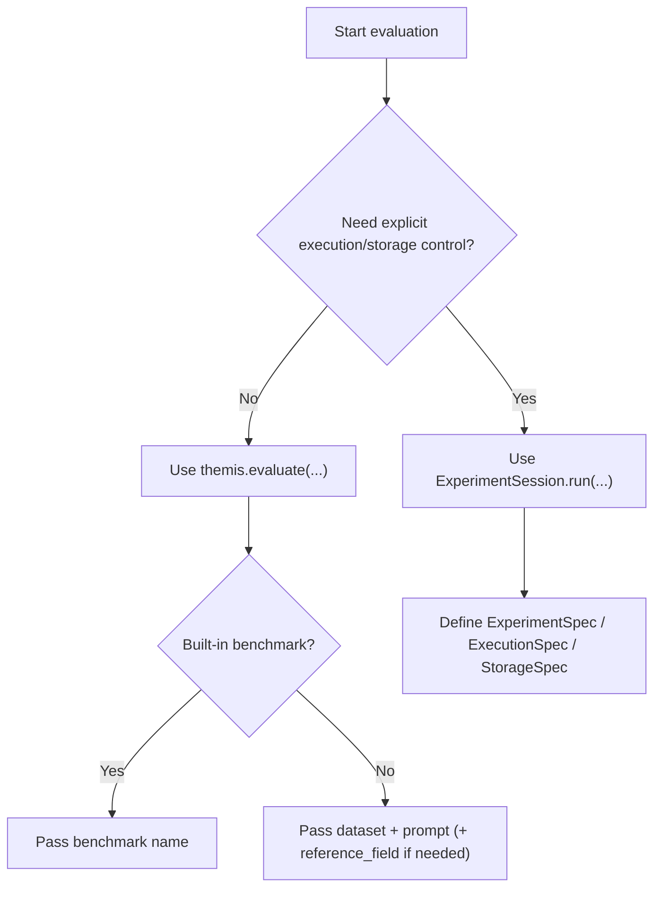

# Evaluation Guide

Workflow guide for running evaluations and interpreting results.

This page focuses on *how to run evaluations effectively*. It intentionally does
not duplicate benchmark catalogs or full API signatures.

- Benchmark list and defaults: [Benchmarks Reference](../reference/benchmarks.md)
- Metric catalog: [Metrics API](../api/metrics.md)
- Full `evaluate(...)` parameters: [evaluate() API](../api/evaluate.md)

## Choose the Entry Point

| Entry point | Best for | Trade-off |
| --- | --- | --- |
| `themis.evaluate(...)` | Fast experiments, benchmark runs, quick custom datasets | Less explicit wiring |
| `ExperimentSession().run(spec, ...)` | Reproducible research workflows, explicit orchestration | More setup code |



## Workflow 1: Quick Benchmark Run

```python
from themis import evaluate

report = evaluate(
    "gsm8k",
    model="gpt-4o-mini",
    limit=100,
    run_id="gsm8k-gpt4o-mini-baseline",
    resume=True,
)
```

Use this path when you want:
- preset prompt/template + extractor + metrics
- cache/resume behavior with minimal code
- quick benchmarking loops

## Workflow 2: Custom Dataset with `evaluate(...)`

Use this when your data is already in-memory and you want a concise API.

```python
from themis import evaluate

dataset = [
    {"id": "1", "question": "2+2", "gold_label": "4"},
    {"id": "2", "question": "3+3", "gold_label": "6"},
]

report = evaluate(
    dataset,
    model="fake:fake-math-llm",
    prompt="Q: {question}\nA:",
    metrics=["exact_match", "response_length"],
    reference_field="gold_label",
    run_id="custom-gold-label",
)
```

Notes:
- For custom datasets, set `reference_field` if your reference column is not
  `answer` or `reference`.
- Mixed/partial reference columns fail fast by design.
- Keep `id` (or equivalent) stable for reliable comparisons across runs.

## Workflow 3: Spec-Driven Session (Full Control)

Use this for explicit execution/storage configuration and reproducibility.

```python
from themis.evaluation.pipeline import EvaluationPipeline
from themis.presets import get_benchmark_preset
from themis.session import ExperimentSession
from themis.specs import ExecutionSpec, ExperimentSpec, StorageSpec

preset = get_benchmark_preset("gsm8k")
pipeline = EvaluationPipeline(extractor=preset.extractor, metrics=preset.metrics)

spec = ExperimentSpec(
    dataset=preset.load_dataset(limit=100),
    prompt=preset.prompt_template.template,
    model="litellm:gpt-4o-mini",
    sampling={"temperature": 0.0, "top_p": 0.95, "max_tokens": 512},
    provider_options={"seed": 42},
    pipeline=pipeline,
    run_id="gsm8k-spec-baseline",
    dataset_id_field=preset.dataset_id_field,
    reference_field=preset.reference_field,
    metadata_fields=preset.metadata_fields,
)

report = ExperimentSession().run(
    spec,
    execution=ExecutionSpec(workers=8, max_retries=3),
    storage=StorageSpec(path=".cache/experiments", cache=True),
)
```

## Reading Results

### Aggregates

```python
for metric_name, aggregate in report.evaluation_report.metrics.items():
    print(metric_name, aggregate.mean, aggregate.count)
```

### Per-sample records

```python
for record in report.evaluation_report.records[:5]:
    sample_scores = {s.metric_name: s.value for s in record.scores}
    print(record.sample_id, sample_scores, record.failures)
```

### Generation failures

```python
for failure in report.failures:
    print(failure.sample_id, failure.message)
```

## Reproducibility Checklist

- Pin model identifier (`provider:model_id`).
- Use deterministic sampling when possible (`temperature=0.0`).
- Set explicit `run_id`.
- Keep storage path stable across reruns.
- Keep dataset IDs stable (`dataset_id_field`) for aligned comparisons.
- Preserve reference-field consistency (`reference_field`).

## Typical Evaluation Loop

1. Run a baseline (`run_id=...-baseline`).
2. Change one variable (model, prompt, sampling, or metric set).
3. Run a variant (`run_id=...-variant`).
4. Compare runs with statistical analysis (see [Comparison Guide](comparison.md)).


## Related Docs

- [Benchmarks Reference](../reference/benchmarks.md)
- [evaluate() API](../api/evaluate.md)
- [Metrics API](../api/metrics.md)
- [Countdown Tutorial](countdown-tutorial.md)
- [Comparison Guide](comparison.md)

