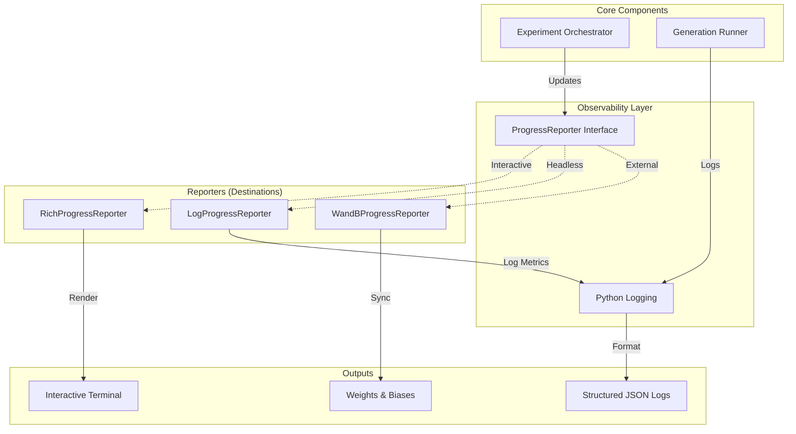

# Observability Guide

Themis provides a comprehensive observability stack designed for both interactive development and production-grade experimentation. This guid covers logging, progress reporting, distributed tracing, and external integrations.

## Architecture

The observability system follows a layered architecture where the **Orchestrator** emits high-level events that are routed through the **ProgressReporter** abstraction to various destinations.



## Logging

Themis supports two primary logging modes, controlled via configuration or CLI flags.

### Human-Readable (Default)
Optimized for interactive use. Uses `rich.logging.RichHandler` to provide colorful, formatted logs with keyword highlighting.

```bash
themis run ... --verbose
```

**Features:**
-   **Color-coding**: Errors are red, warnings yellow, info blue.
-   **Keyword Highlighting**: Terms like `Orchestrator`, `Model`, `Metric` are automatically highlighted.
-   **Tracebacks**: Richly formatted exception tracebacks.

### Structured JSON
Optimized for machine consumption (e.g., Datadog, Splunk, CloudWatch).

```bash
themis run ... --json-logs
```

**Format:**
```json
{
  "timestamp": "2023-10-27T10:00:00.123Z",
  "level": "INFO",
  "message": "Task completed",
  "logger": "themis.orchestrator",
  "trace_id": "a1b2c3d4...",
  "span_id": "e5f6g7h8...",
  "extra_field": "value"
}
```

### Distributed Tracing
Every log record automatically includes `trace_id` and `span_id` fields when run within a tracing context. This allows you to correlate logs across distributed components.

## Progress Reporting

Themis adapts its progress reporting based on the environment.

### Interactive Mode
When running in a TTY or without `--json-logs`, Themis uses `RichProgressReporter`.
-   **Visuals**: Spinners, progress bars, percentage completion.
-   **Stats**: Real-time counters for success/failure/total.

### Headless/Log Mode
When running with `--json-logs`, Themis uses `LogProgressReporter`.
-   **Frequency**: Logs progress updates at significant intervals (every 10% or 30s) to avoid log flooding.
-   **Format**: JSON log entries with `event="progress_update"`.

### Composite Reporting
The system supports multiple reporters simultaneously. For example, you can have a terminal progress bar *and* stream metrics to WandB.

## External Integrations

### Weights & Biases (WandB)
Themis has first-class support for WandB tracking.

**Setup:**
1.  Install the library: `pip install wandb`
2.  Login: `wandb login`
3.  Configure your run:

```python
config = IntegrationsConfig(
    wandb=WandbConfig(
        enable=True,
        project="my-experiment",
        entity="my-team"
    )
)
```

**Features:**
-   **Real-time Metrics**: Progress, success rates, and token usage streamed live.
-   **Results Logging**: Final evaluation reports logged as WandB Tables.
-   **Artifact Tracking**: Experiment manifests and configs are tracked.
