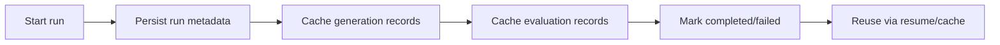
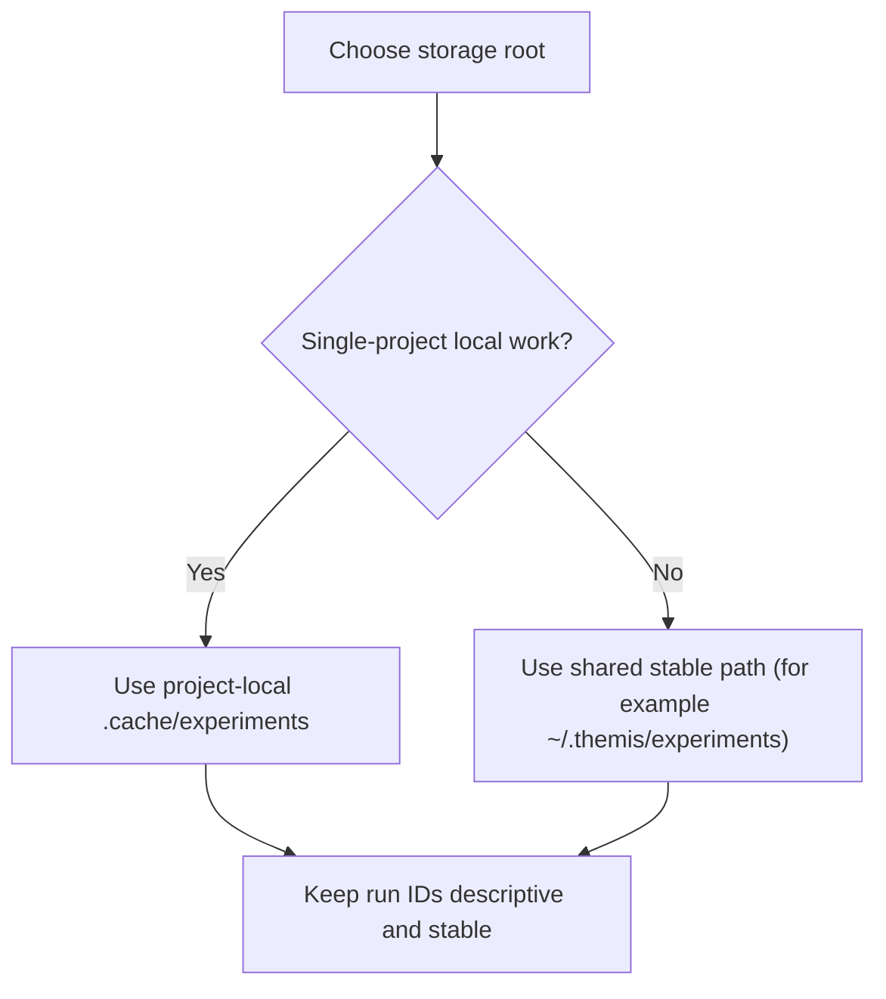

# Storage Guide

Themis stores run artifacts under a storage root (default: `.cache/experiments`).

## Storage Lifecycle



## Configure Storage

### Python API

```python
report = evaluate(
    "gsm8k",
    model="gpt-4",
    storage=".cache/experiments",
    run_id="gsm8k-gpt4",
    resume=True,
)
```

### CLI

```bash
themis eval gsm8k --model gpt-4 --storage .cache/experiments
```

You can also set a default path:

```bash
export THEMIS_STORAGE="~/.themis/experiments"
```

## How to Choose a Storage Path



## Run Management

```bash
# list runs
themis list runs --verbose

# preview cleanup
themis clean --older-than 30 --dry-run

# delete old runs
themis clean --older-than 30
```

## Practical Recommendations

- Use explicit `run_id` values to make comparisons repeatable.
- Keep one storage root per environment (dev/staging/prod) to avoid mixing runs.
- Leave `resume=True` when iterating on prompt/model tweaks to save cost.
- Use `--dry-run` before cleanup commands.

## Stored Artifacts

Typical per-run artifacts include generation/evaluation caches and exported reports.
Use `themis share <RUN_ID>` to create shareable badge + markdown outputs.
