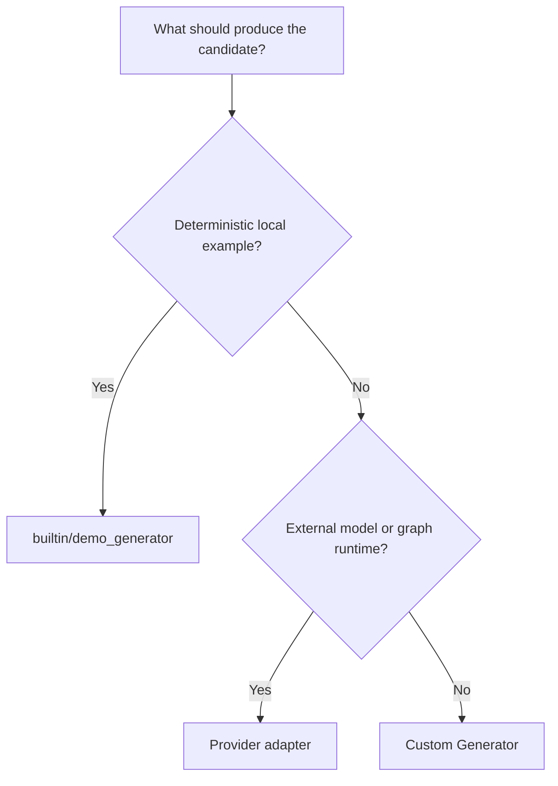

# Configure generators

Goal: pick and configure a generator implementation for your run.

When to use this:

Use this guide when generation is the main variable you are changing and you already know the task you want to run.

## Procedure

Use this chooser when generation is the variable you are changing and the rest of the runtime should remain stable.



The choice is mainly about where candidate production lives, not whether Themis still owns fan-out, storage, and inspection.

Use the builtin demo generator for deterministic tutorials, smoke tests, and local examples.

Use provider adapters when Themis should still own fan-out, reduction, storage, and inspection, but an external model or graph runtime should produce the candidate output.

Review these example sources:

```python
--8<-- "examples/docs/custom_generator.py"
```

```python
--8<-- "examples/docs/provider_openai.py"
```

```python
--8<-- "examples/docs/provider_vllm.py"
```

```python
--8<-- "examples/docs/provider_langgraph.py"
```

--8<-- "docs/_snippets/how-to/provider-generators-note.md"

## Variants

- builtin deterministic runs: `builtin/demo_generator`
- provider-backed generation: adapter helpers in `themis.adapters`
- fully custom generation: implement `Generator`

## Expected result

You should know which generator style matches your run and what prerequisites or optional extras are required.

## Troubleshooting

- [Install extras and configure providers](install-extras-and-configure-providers.md)
- [Adapters reference](../reference/adapters.md)
- [Generation vs evaluation](../explanation/generation-vs-evaluation.md)
