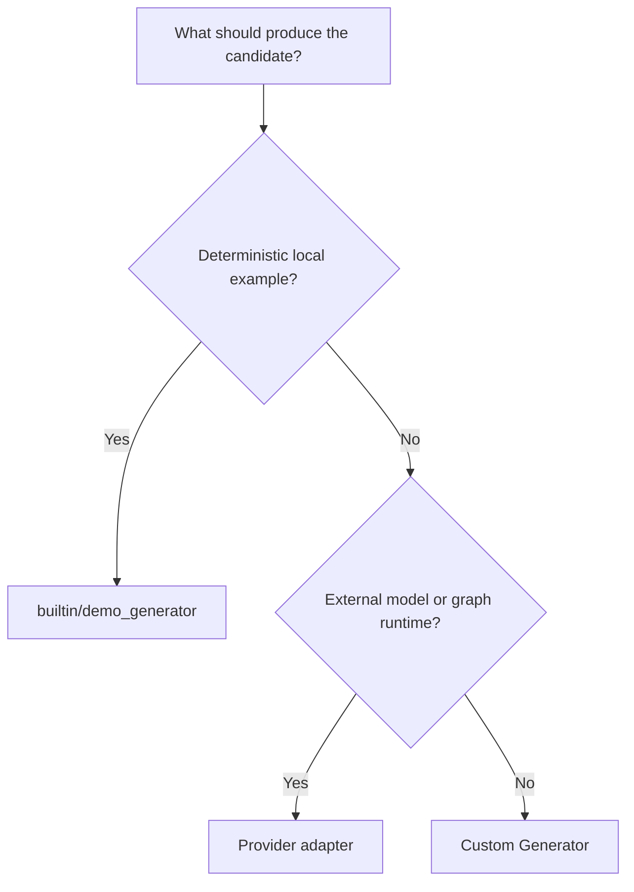

# Configure generators

Goal: pick and configure a generator implementation for your run.

When to use this:

Use this guide when generation is the main variable you are changing and you already know the task you want to run.

## Procedure

Use this chooser when generation is the variable you are changing and the rest of the runtime should remain stable.



The choice is mainly about where candidate production lives, not whether Themis still owns fan-out, storage, and inspection.

Use the builtin demo generator for deterministic tutorials, smoke tests, and local examples.

Use provider adapters when Themis should still own fan-out, reduction, storage, and inspection, but an external model or graph runtime should produce the candidate output.

Prompt-focused experiments:

- set `GenerationConfig.prompt_spec` when you want prompt instructions, prefixes, suffixes, or generic prompt blocks to be part of the experiment identity
- `PromptSpec.blocks` is intentionally generic prompt material, not an example-specific feature
- prompt specs flow into `GenerateContext`, so custom generators can consume them directly
- provider-backed adapters such as OpenAI also consume prompt specs, which means prompt changes invalidate generation-stage cache reuse as expected

Review these example sources:

```python
--8<-- "examples/docs/custom_generator.py"
```

```python
--8<-- "examples/docs/provider_openai.py"
```

```python
--8<-- "examples/docs/provider_vllm.py"
```

```python
--8<-- "examples/docs/provider_langgraph.py"
```

--8<-- "docs/_snippets/how-to/provider-generators-note.md"

## Variants

| Variant | Best when | Tradeoff | Related APIs / commands |
| --- | --- | --- | --- |
| Builtin deterministic runs | You want tutorials, smoke tests, or fixture-backed examples without external providers | Not representative of production model behavior | `builtin/demo_generator` |
| Provider-backed generation | An external endpoint or graph runtime should generate outputs while Themis owns the rest of the run | Requires provider extras, clients, or service setup | `themis.adapters.openai(...)`, `themis.adapters.vllm(...)`, `themis.adapters.langgraph(...)` |
| Fully custom generation | Candidate production logic belongs entirely in your own code | Highest implementation effort | `Generator` |
| Prompt-only experiment change | The generator stays fixed and prompt material is the only experiment variable | Less useful when provider or generator behavior also needs to change | `GenerationConfig.prompt_spec`, `PromptSpec.blocks` |

## Expected result

You should know which generator style matches your run and what prerequisites or optional extras are required.

## Troubleshooting

- [Install extras and configure providers](install-extras-and-configure-providers.md)
- [Adapters reference](../reference/adapters.md)
- [Generation vs evaluation](../explanation/generation-vs-evaluation.md)
