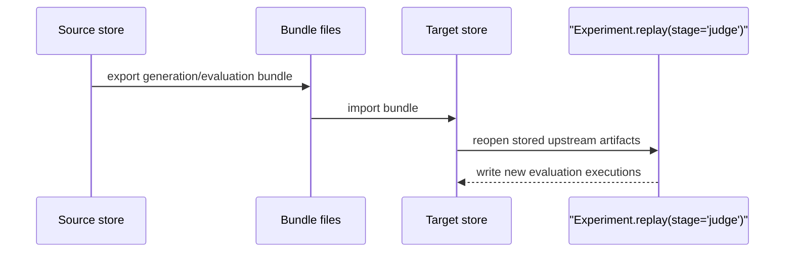

# Reproduce and rejudge runs

Goal: export/import run artifacts and replay downstream evaluation stages from stored upstream data.

When to use this:

Use this guide when generation should stay fixed but evaluation needs to move stores or be rerun from a downstream stage.

## Procedure

Use this sequence when you need to move evidence or rerun workflow-backed evaluation without regenerating candidates.



The crucial boundary is that upstream artifacts stay fixed while downstream work moves or reruns.

Stage handoff boundaries:

- CLI-visible bundle export currently covers `generation` and `evaluation`
- reduction, parse, and score bundle handoff is Python-only today through `export_reduction_bundle(...)`, `export_parse_bundle(...)`, `export_score_bundle(...)`, and their matching import helpers
- imported artifacts are normalized back into standard event history, so `resume`, `report`, `compare`, and cache reuse see the imported data exactly like locally produced data

```python
--8<-- "examples/docs/rejudge_bundle.py"
```

--8<-- "docs/_snippets/how-to/reproduce-note.md"

## Variants

| Variant | Best when | Tradeoff | Related APIs / commands |
| --- | --- | --- | --- |
| Portable generation artifacts only | Candidate outputs should move to another store or environment before any new evaluation work | Downstream stages still need to run later | `export_generation_bundle(...)`, `import_generation_bundle(...)` |
| Portable reduction, parse, or score artifacts | Intermediate stages, not just generation or judging, must move across environments | Python-only today, so less convenient than CLI export | `export_reduction_bundle(...)`, `export_parse_bundle(...)`, `export_score_bundle(...)` |
| Portable evaluation artifacts too | Judge executions should move with the run | More artifact management than an in-place replay | `export_evaluation_bundle(...)`, `import_evaluation_bundle(...)` |
| Rerun workflow-backed metrics in place | Generation stays fixed and only judge outputs should change | Requires stored upstream artifacts and judge access | `Experiment.replay(stage="judge")` |
| Rerun pure scoring from parsed outputs | Parsing is fixed and deterministic scoring should be recomputed | Only useful when upstream parsing is already good | `Experiment.replay(stage="score")` |
| Stop a run intentionally at a boundary first | You know ahead of time that generation or parsing should stop early for handoff | Requires a second step to continue later | `Experiment.run(..., until_stage=...)` |

## Expected result

You should be able to move artifacts between stores and replay downstream stages without regenerating candidates.

## Troubleshooting

- [Reproducibility and rejudge](../explanation/reproducibility-and-rejudge.md)
- [Stores and inspection reference](../reference/stores-and-inspection.md)
