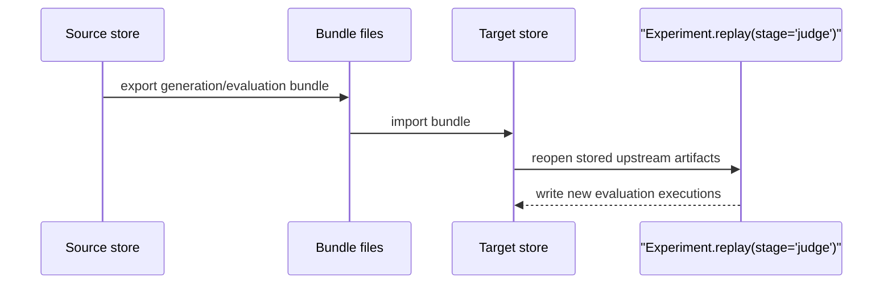

# Reproduce and rejudge runs

Goal: export/import run artifacts and replay downstream evaluation stages from stored upstream data.

When to use this:

Use this guide when generation should stay fixed but evaluation needs to move stores or be rerun from a downstream stage.

## Procedure

Use this sequence when you need to move evidence or rerun workflow-backed evaluation without regenerating candidates.



The crucial boundary is that upstream artifacts stay fixed while downstream work moves or reruns.

Stage handoff boundaries:

- CLI-visible bundle export currently covers `generation` and `evaluation`
- reduction, parse, and score bundle handoff is Python-only today through `export_reduction_bundle(...)`, `export_parse_bundle(...)`, `export_score_bundle(...)`, and their matching import helpers
- imported artifacts are normalized back into standard event history, so `resume`, `report`, `compare`, and cache reuse see the imported data exactly like locally produced data

```python
--8<-- "examples/docs/rejudge_bundle.py"
```

--8<-- "docs/_snippets/how-to/reproduce-note.md"

## Variants

- portable generation artifacts only: generation bundle export/import
- portable reduction, parse, or score artifacts: Python-only stage bundle export/import
- portable evaluation artifacts too: evaluation bundle export/import
- rerun workflow-backed metrics in place: `Experiment.replay(stage="judge")`
- rerun pure scoring from parsed outputs: `Experiment.replay(stage="score")`
- stop a run intentionally at a boundary first: `Experiment.run(..., until_stage="generate"|"reduce"|"parse"|"score")`

## Expected result

You should be able to move artifacts between stores and replay downstream stages without regenerating candidates.

## Troubleshooting

- [Reproducibility and rejudge](../explanation/reproducibility-and-rejudge.md)
- [Stores and inspection reference](../reference/stores-and-inspection.md)
