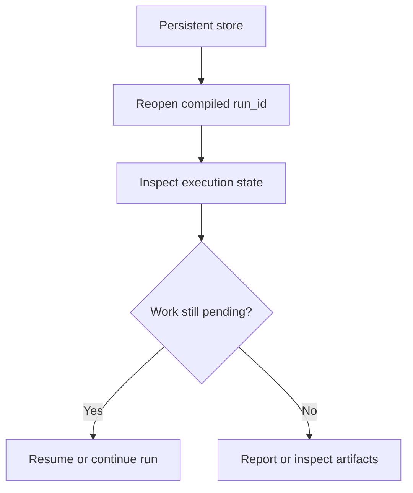

# Resume and inspect runs

Goal: continue interrupted work and inspect stored snapshots, execution state, and evaluation artifacts.

When to use this:

Use this guide when a run already exists and you want to inspect or continue it rather than starting from scratch.

## Procedure

Use this flow when you need to reopen first and decide later whether any new execution is required.

The safe order is reopen, inspect, and only then decide whether to continue execution.

1. Use a persistent store, typically SQLite.
2. Reopen the run by the same compiled `run_id`.
3. Inspect execution state before rerunning anything.
4. Use the CLI or Python helpers to examine progress and failures.

## Variants

- quick state summary: `themis quickcheck`
- stored snapshot inspection: `get_run_snapshot(...)` or `themis inspect snapshot`
- explicit persisted state inspection: `get_execution_state(...)`
- workflow execution inspection: `get_evaluation_execution(...)` or `themis inspect evaluation`
- report generation from the stored run: `Reporter` or `themis report`

## Expected result

You should know whether the run can be resumed, what already completed, and where failures occurred.

## Troubleshooting

- [Failure, retry, and resume](../explanation/failure-retry-and-resume.md)
- [CLI reference](../reference/cli.md)
