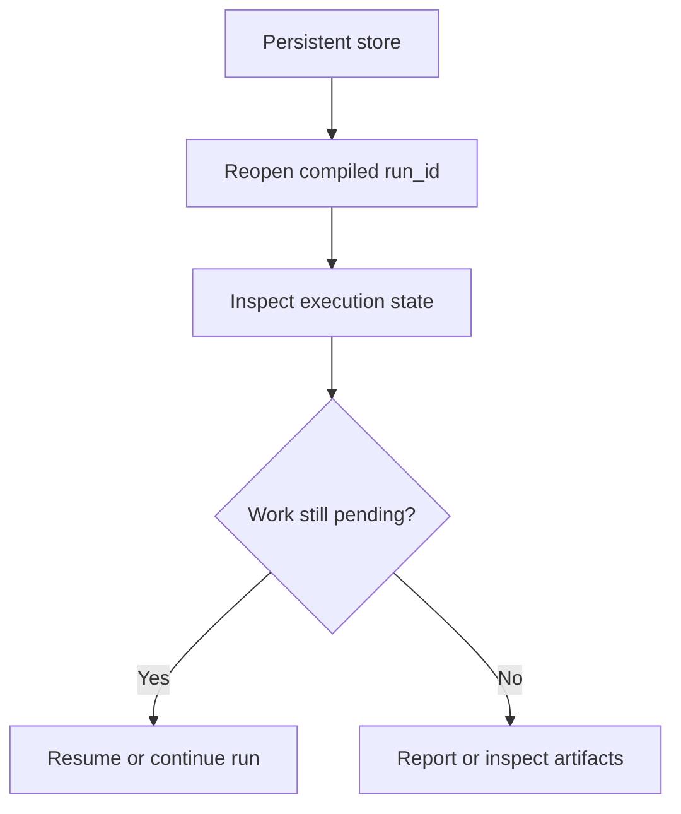

# Resume and inspect runs

Goal: continue interrupted work and inspect stored snapshots, execution state, and evaluation artifacts.

When to use this:

Use this guide when a run already exists and you want to inspect or continue it rather than starting from scratch.

## Procedure

Use this flow when you need to reopen first and decide later whether any new execution is required.

The safe order is reopen, inspect, and only then decide whether to continue execution.

1. Use a persistent store, typically SQLite.
2. Reopen the run by the same compiled `run_id`.
3. Inspect execution state before rerunning anything.
4. Decide whether you want to continue the same run, stop at a stage boundary, or replay only a downstream stage.
5. Use the CLI or Python helpers to examine progress and failures.

Stage-limited execution:

- `Experiment.run(..., until_stage="generate"|"reduce"|"parse"|"score"|"judge")`
- `themis run --config ... --until-stage generate|reduce|parse|score|judge`
- stored runs record `completed_through_stage`, so a generation-only run is considered complete for that stage instead of looking like an interrupted failure

Existing-run behavior:

- `RuntimeConfig(existing_run_policy="auto")`: completed runs are reused and incomplete runs resume
- `RuntimeConfig(existing_run_policy="error")`: fail fast if the compiled `run_id` already exists
- `RuntimeConfig(existing_run_policy="rerun")`: clear the stored run and execute it again

Portable stage artifacts:

- generation: `export_generation_bundle(...)` / `import_generation_bundle(...)`
- reduction: `export_reduction_bundle(...)` / `import_reduction_bundle(...)`
- parse: `export_parse_bundle(...)` / `import_parse_bundle(...)`
- score: `export_score_bundle(...)` / `import_score_bundle(...)`
- evaluation workflow executions: `export_evaluation_bundle(...)` / `import_evaluation_bundle(...)`

Imported artifacts are persisted through normal events, so `resume`, `report`, cache reuse, and replay all see the same stored state.

## Variants

- quick state summary: `themis quickcheck`
- stored snapshot inspection: `get_run_snapshot(...)` or `themis inspect snapshot`
- explicit persisted state inspection: `get_execution_state(...)`
- workflow execution inspection: `get_evaluation_execution(...)` or `themis inspect evaluation`
- downstream-only recompute: `Experiment.replay(stage="reduce"|"parse"|"score"|"judge")`
- report generation from the stored run: `Reporter` or `themis report`

## Expected result

You should know whether the run can be resumed, what already completed, and where failures occurred.

## Troubleshooting

- [Failure, retry, and resume](../explanation/failure-retry-and-resume.md)
- [Compare, export, and report](compare-export-and-report.md)
- [CLI reference](../reference/cli.md)
