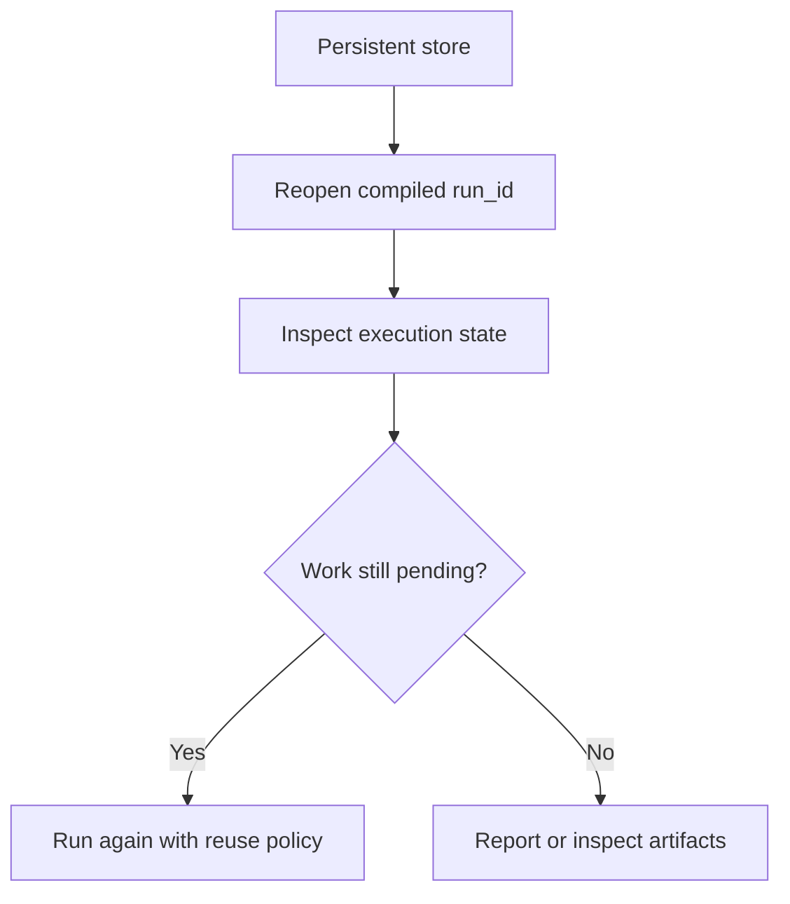

# Resume and inspect runs

Goal: inspect stored snapshots, execution state, and evaluation artifacts before deciding whether to continue work.

When to use this:

Use this guide when a run already exists and you want to inspect or continue it rather than starting from scratch.

## Procedure

Use this flow when you need to reopen first and decide later whether any new execution is required.

```mermaid
flowchart TD
    A["Persistent store"] --> B["Reopen compiled run_id"]
    B --> C["Inspect execution state"]
    C --> D{"Work still pending?"}
    D -->|Yes| E["Run again with reuse policy"]
    D -->|No| F["Report or inspect artifacts"]
```

The safe order is reopen, inspect, and only then decide whether to continue execution.

1. Use a persistent store, typically SQLite.
2. Reopen the run by the same compiled `run_id`.
3. Inspect execution state before rerunning anything.
4. Decide whether you want to continue the same run with `Experiment.run(...)` / `themis run`, stop at a stage boundary, or replay only a downstream stage.
5. Use the CLI or Python helpers to examine progress and failures.

Checkpointed resume:

- stores persist execution checkpoints alongside the event stream
- normal resume and state inspection use a fresh checkpoint when available
- stale or missing checkpoints fall back to the authoritative event stream

Stage-limited execution:

- `Experiment.run(..., until_stage=Stage.GENERATE|REDUCE|PARSE|SCORE|JUDGE)`
- `themis run --config ... --until-stage generate|reduce|parse|score|judge`
- stored runs record `completed_through_stage`, so a generation-only run is considered complete for that stage instead of looking like an interrupted failure

Existing-run behavior:

- `RunOptions(existing_run_policy="reuse")`: completed runs are reused and incomplete runs resume
- `RunOptions(existing_run_policy="error")`: fail fast if the compiled `run_id` already exists
- `RunOptions(existing_run_policy="restart")`: clear the stored run and execute it again

Targeted reruns:

- `Experiment.rerun(from_stage=Stage.SCORE, failed_only=True, metric_ids=[...])`
- `themis rerun --config ... --stage score --failed-only --metric-id ...`
- use `--case-id`, `--case-key`, or `--metadata key=value` to target slices without cloning the whole experiment

Portable stage artifacts:

- generation: `export_generation_bundle(...)` / `import_generation_bundle(...)`
- reduction: `export_reduction_bundle(...)` / `import_reduction_bundle(...)`
- parse: `export_parse_bundle(...)` / `import_parse_bundle(...)`
- score: `export_score_bundle(...)` / `import_score_bundle(...)`
- evaluation workflow executions: `export_evaluation_bundle(...)` / `import_evaluation_bundle(...)`

Imported artifacts are persisted through normal events, so `resume`, `report`, cache reuse, and replay all see the same stored state.

## Variants

| Variant | Best when | Tradeoff | Related APIs / commands |
| --- | --- | --- | --- |
| Quick state summary | You need a fast operational check before digging deeper | Less detail than snapshot, state, or report views | `themis quickcheck` |
| CLI status reopen | You need stored status and completion counts for the compiled `run_id` | Does not execute pending stages | `themis resume --config ...` |
| Stored snapshot inspection | You want identity and provenance details for the run | Does not show per-stage execution progress by itself | `get_run_snapshot(...)`, `themis inspect snapshot` |
| Explicit persisted state inspection | You need stage completion, counts, and failure state | Lower-level than a report | `get_execution_state(...)`, `themis inspect state` |
| Workflow execution inspection | You need judge prompts, responses, or workflow artifacts for one case | Only applies to workflow-backed metrics | `get_evaluation_execution(...)`, `themis inspect evaluation` |
| Downstream-only recompute | Upstream artifacts are good and only later stages should rerun | Requires stored artifacts and careful stage choice | `Experiment.replay(from_stage=Stage.REDUCE)` |
| Targeted rerun | Only failed cases, a case slice, or a metric should rerun | Preserves the compiled run identity and records rerun lineage | `Experiment.rerun(...)`, `themis rerun` |
| Report generation from the stored run | You want shareable output after inspection | Requires a persistent run state to report from | `Reporter`, `themis report` |

## Expected result

You should know whether the run can be resumed, what already completed, and where failures occurred.

## Troubleshooting

- [Failure, retry, and resume](../explanation/failure-retry-and-resume.md)
- [Compare, export, and report](compare-export-and-report.md)
- [CLI reference](../reference/cli.md)
