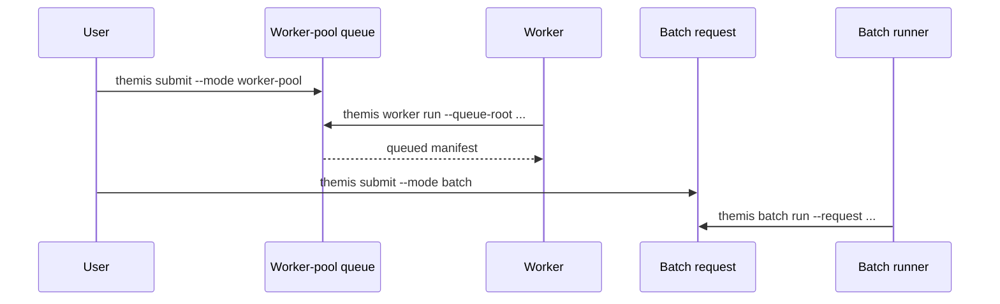

# Use submit, worker, and batch

Goal: hand off execution through manifest-backed deferred workflows.

When to use this:

Use this guide when in-process `run()` is not the right operational shape and you need queued or request-based execution.

## Procedure

Use this comparison when you need to decide whether execution is queue-driven or request-manifest-driven.



Both flows hand execution off through a manifest, but they differ in whether work is pulled from a queue or invoked by an explicit request file.

Worker-pool flow:

```bash
themis submit --config experiment.yaml --mode worker-pool
themis worker run --queue-root runs/queue
```

Batch flow:

```bash
themis submit --config experiment.yaml --mode batch
themis batch run --request runs/batch/requests/<run-id>.json
```

## Variants

| Variant | Best when | Tradeoff | Related APIs / commands |
| --- | --- | --- | --- |
| Single-host queued work | Workers should pull manifests from a shared queue root | Requires a worker process to keep polling | `themis submit --mode worker-pool`, `themis worker run --queue-root ...` |
| Request and completed manifest flow | Each run should execute from an explicit request file | Less queue-like than worker-pool mode | `themis submit --mode batch`, `themis batch run --request ...` |

## Expected result

The run should execute from a manifest without direct in-process orchestration at the point of execution.

## Troubleshooting

- [First external execution](../tutorials/first-external-execution.md)
- [CLI reference](../reference/cli.md)
