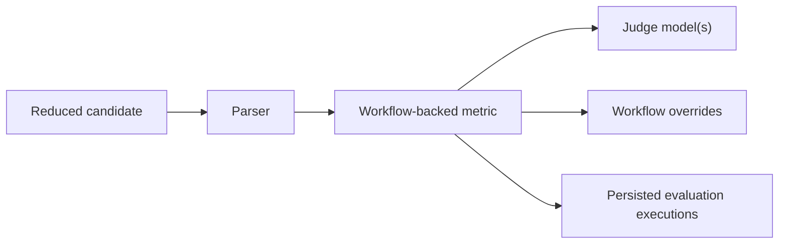

# Use workflow-backed metrics

Goal: configure judge-backed metrics and inspect their execution artifacts.

When to use this:

Use this guide when deterministic pure scoring is not sufficient and Themis should own an evaluation workflow.

## Procedure

Use this task map when you need to confirm the minimum pieces required for judge-backed scoring.



The runtime builds a workflow around the metric, so the important setup work is choosing the right subject, judge, and overrides.

Provide:

- one or more workflow-backed metrics
- parsers for the reduced candidate
- judge models
- optional `prompt_spec` for judge prompt instructions or generic prompt blocks
- any workflow overrides such as a rubric

```python
--8<-- "examples/docs/workflow_metrics.py"
```

--8<-- "docs/_snippets/how-to/workflow-metrics-note.md"

## Variants

| Variant | Best when | Tradeoff | Related APIs / commands |
| --- | --- | --- | --- |
| Rubric scoring | One judge and one rubric are enough | Less resilient to judge variance than panel-style setups | `builtin/llm_rubric` |
| Multi-judge averaging | Multiple judges should score the same output and aggregate | Higher latency and judge-model cost | `builtin/panel_of_judges` |
| Majority-vote judgment | The output should collapse to a categorical majority decision | Loses scalar nuance compared with averaging | `builtin/majority_vote_judge` |
| Pairwise selection | Two candidates should be compared directly | Not a drop-in replacement for single-output scoring | `builtin/pairwise_judge` |
| Heterogeneous multi-judge orchestration | Different prompts or parsing logic should run over the same response | Requires a custom workflow metric in Python | Custom workflow metric, `ctx.prompt_spec` |

## Expected result

The run should persist evaluation executions with judge calls, prompts, responses, and final scores or aggregation output.

Builtin judge workflows consume `PromptSpec.blocks` directly. Custom workflow metrics should read `ctx.prompt_spec` themselves when they need benchmark-derived context, retrieved context, reference judgments, or any other prompt material that should travel with the experiment identity.

## Troubleshooting

- [First LLM-judged evaluation](../tutorials/first-llm-judged-evaluation.md)
- [Metric families and subjects](../explanation/metric-families-and-subjects.md)
