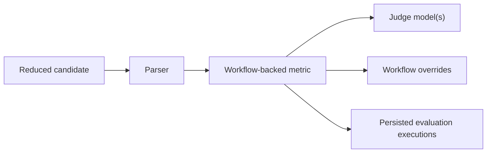

# Use workflow-backed metrics

Goal: configure judge-backed metrics and inspect their execution artifacts.

When to use this:

Use this guide when deterministic pure scoring is not sufficient and Themis should own an evaluation workflow.

## Procedure

Use this task map when you need to confirm the minimum pieces required for judge-backed scoring.



The runtime builds a workflow around the metric, so the important setup work is choosing the right subject, judge, and overrides.

Provide:

- one or more workflow-backed metrics
- parsers for the reduced candidate
- judge models
- optional `prompt_spec` for judge prompt instructions or few-shot examples
- any workflow overrides such as a rubric

```python
--8<-- "examples/docs/workflow_metrics.py"
```

--8<-- "docs/_snippets/how-to/workflow-metrics-note.md"

## Variants

- rubric scoring: `builtin/llm_rubric`
- multi-judge averaging: `builtin/panel_of_judges`
- majority-vote judgment: `builtin/majority_vote_judge`
- pairwise selection: `builtin/pairwise_judge`
- heterogeneous multi-judge orchestration: author a custom workflow metric in Python when different prompts or parsing logic should run over the same response

## Expected result

The run should persist evaluation executions with judge calls, prompts, responses, and final scores or aggregation output.

## Troubleshooting

- [First LLM-judged evaluation](../tutorials/first-llm-judged-evaluation.md)
- [Metric families and subjects](../explanation/metric-families-and-subjects.md)
