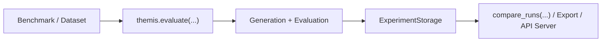

<div class="landing-hero">
  <p class="hero-kicker">Themis Documentation</p>
  <h1 class="hero-title">Evaluate LLMs with confidence.</h1>
  <p class="hero-subtitle">
    Themis gives research teams a clean workflow for running benchmarks,
    tracking experiments, and comparing models with statistical rigor.
  </p>
  <div class="hero-actions">
    <a class="md-button md-button--primary" href="getting-started/quickstart/">Start Quickstart</a>
    <a class="md-button" href="guides/cli/">View CLI Guide</a>
  </div>
</div>

## Choose Your Path

<div class="path-grid">
  <a class="path-card" href="getting-started/installation/">
    <h3>Install</h3>
    <p>Set up Themis and verify your environment.</p>
  </a>
  <a class="path-card" href="getting-started/quickstart/">
    <h3>Run First Eval</h3>
    <p>Use `evaluate(...)` and get your first metrics quickly.</p>
  </a>
  <a class="path-card" href="guides/evaluation/">
    <h3>Design Experiments</h3>
    <p>Move from one-liners to spec/session-driven workflows.</p>
  </a>
  <a class="path-card" href="guides/comparison/">
    <h3>Compare Runs</h3>
    <p>Analyze run deltas with statistical tests.</p>
  </a>
  <a class="path-card" href="reference/benchmarks/">
    <h3>Explore Benchmarks</h3>
    <p>Browse built-in benchmarks and expected formats.</p>
  </a>
  <a class="path-card" href="api/overview/">
    <h3>Dive Into API</h3>
    <p>Use the full Python API and extension points.</p>
  </a>
</div>

## Core Workflow



## Quick Recipes

=== "Evaluate"

    ```bash
    themis eval gsm8k --model gpt-4 --limit 100 --run-id gsm8k-gpt4
    ```

=== "Compare"

    ```bash
    themis compare gsm8k-gpt4 gsm8k-claude --output comparison.html
    ```

=== "Serve Dashboard"

    ```bash
    themis serve --storage .cache/experiments
    ```

## Release Spotlight

!!! success "Themis 1.2.0"
    Massive architectural cleanup: removed obsolete `MetricPipeline` and `FlexibleGenerationPlan`, unified entries into `themis.evaluate()`, stripped deprecations, and hardened `examples/`.

    [Read the full 1.2.0 notes](releases/1.2.0.md)

## Documentation Map

- [Getting Started](getting-started/installation.md): installation, quickstart, and core concepts.
- [Guides](guides/evaluation.md): evaluation design, storage, providers, comparison, and interoperability.
- [Reference](reference/benchmarks.md): benchmarks and API server details.
- [Python API](api/overview.md): function/class-level API behavior.
- [Architecture](ARCHITECTURE.md): module boundaries and design decisions.

## Runnable Examples

- [examples/01_quickstart.py](https://github.com/Pittawat2542/themis/blob/main/examples/01_quickstart.py)
- [examples/02_custom_dataset.py](https://github.com/Pittawat2542/themis/blob/main/examples/02_custom_dataset.py)
- [examples/04_comparison.py](https://github.com/Pittawat2542/themis/blob/main/examples/04_comparison.py)
- [examples/08_resume_cache.py](https://github.com/Pittawat2542/themis/blob/main/examples/08_resume_cache.py)
- [examples/09_research_loop.py](https://github.com/Pittawat2542/themis/blob/main/examples/09_research_loop.py)
