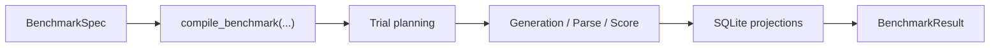

# Themis

Themis is a benchmark-first evaluation framework for LLM systems.

The public workflow is intentionally small:

- author one `ProjectSpec`
- author one `BenchmarkSpec`
- register engines, parsers, metrics, judges, and hooks in `PluginRegistry`
- run with `Orchestrator`
- inspect a `BenchmarkResult`

```mermaid
flowchart LR
    A["BenchmarkSpec"] --> B["compile_benchmark(...)"]
    B --> C["Trial planning"]
    C --> D["Generation / Parse / Score"]
    D --> E["SQLite projections"]
    E --> F["BenchmarkResult"]
```

## What Changed

- Benchmarks are now first-class. `slice_id`, `prompt_variant_id`, and benchmark dimensions are persisted and queryable.
- Dataset access is query-aware through `DatasetProvider.scan(slice_spec, query)`.
- Parse pipelines are public authoring concepts, not metric-local hacks.
- Reporting is aggregation-first through `BenchmarkResult.aggregate(...)` and `paired_compare(...)`.
- Quick-start paths now include `themis quick-eval`, `themis init`, and a
  built-in benchmark catalog for standard benchmark definitions.
- Agent-style runs support bootstrap message sequences, local tool selection,
  and OpenAI-hosted MCP server selection inside the benchmark model.
- Reproducibility metadata now includes deterministic seed-aware planning,
  streamed benchmark execution helpers, and persisted runtime provenance such as
  tool-handler versions.

## Start Here

- New user: [Quick Start](quick-start/index.md)
- Need the mental model: [Public Surface](introduction/index.md)
- Want worked scripts: [Tutorials](tutorials/index.md)
- Want task-oriented recipes: [Guides](guides/index.md)
- Need exact types and signatures: [API Reference](api-reference/index.md)
