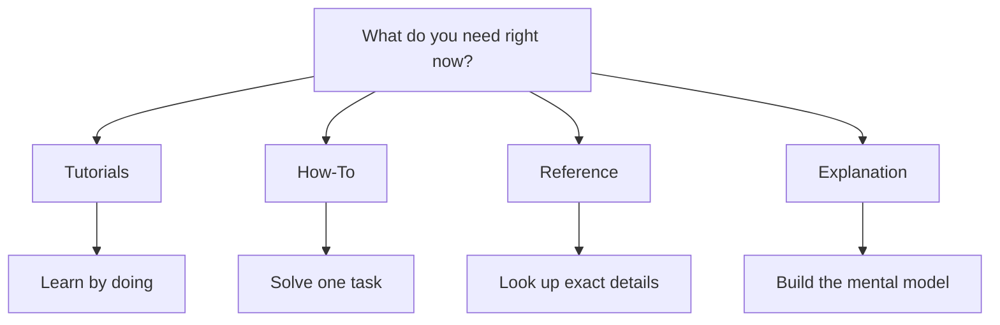

# Themis v4 docs

Themis v4 is a Python-first evaluation runtime built around a compiled `RunSnapshot`, typed generation and evaluation boundaries, and inspectable stored artifacts.

Use this map when you need to decide which kind of document to open first.

```mermaid
flowchart TD
    A["What do you need right now?"]
    A --> B["Tutorials"]
    A --> C["How-To"]
    A --> D["Reference"]
    A --> E["Explanation"]
    B --> B1["Learn by doing"]
    C --> C1["Solve one task"]
    D --> D1["Look up exact details"]
    E --> E1["Build the mental model"]
```

Each quadrant answers a different kind of question, so pick the page type before you pick the topic.

This documentation set is organized by user need:

- Learn by doing: [Tutorials](tutorials/first-evaluate.md)
- Solve a specific task: [How-To guides](how-to/choose-the-right-api-layer.md)
- Look up exact behavior: [Reference](reference/index.md)
- Build a correct mental model: [Explanation](explanation/index.md)
- Share terminology: [Glossary](glossary.md)
- Resolve common confusion quickly: [FAQ](faq.md)
- Contribute to the docs system: [Project](project/index.md)

If you are new to Themis, start with [Start Here](start-here/index.md).
