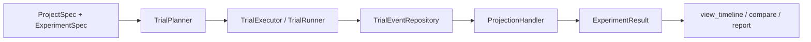

  
Themis Documentation

  <h1 class="hero-title">Code-first evaluation, documented from the implementation up.</h1>
  

    Themis is a typed orchestration layer for repeatable LLM experiments:
    immutable specs on the way in, append-only events and projections on the
    way out, and analysis tools built on top of the stored run history.
  

  

    <a class="md-button md-button--primary" href="quick-start/">Start Quick Start</a>
    <a class="md-button" href="concepts/architecture/">See Architecture</a>
  

## Start Here

  <a class="path-card" href="introduction/">
    <h3>Introduction</h3>
    
Learn the current public surface and the write-side/read-side model.

  </a>
  <a class="path-card" href="installation-setup/">
    <h3>Installation</h3>
    
Pick the right extras for providers, stats, compression, and docs.

  </a>
  <a class="path-card" href="quick-start/">
    <h3>Hello World</h3>
    
Run a complete experiment with one dataset loader, one engine, and one metric.

  </a>
  <a class="path-card" href="tutorials/">
    <h3>Tutorials</h3>
    
Walk through project files, comparisons, and result inspection end to end.

  </a>
  <a class="path-card" href="guides/">
    <h3>Guides</h3>
    
Jump to task-oriented how-tos for loaders, plugins, resume, and quickcheck.

  </a>
  <a class="path-card" href="api-reference/">
    <h3>API Reference</h3>
    
Browse `themis`, specs, orchestration, runtime, storage, and protocol docs.

  </a>

## Persona Paths

- Beginner: [Installation](installation-setup/index.md) -> [Quick Start](quick-start/index.md) -> [Hello World Walkthrough](tutorials/hello-world.md)
- Research scientist: [Validate Dataset Loaders](guides/dataset-validation.md) -> [Compare and Export Results](guides/compare-and-export.md) -> [Reproduce and Share Runs](guides/reproduce-runs.md)
- API / power user: [Introduction](introduction/index.md) -> [API Reference](api-reference/index.md) -> [Storage and Resume](concepts/storage-and-resume.md)

## Current Product Shape

- `ProjectSpec` holds shared policy and storage defaults.
- `ExperimentSpec` expands into deterministic `TrialSpec` instances.
- `PluginRegistry` provides engines, extractors, metrics, judges, and hooks.
- `Orchestrator` plans trials, runs them, stores events, and returns `ExperimentResult`.
- `ExperimentResult` lets you inspect trials, timelines, reports, and paired comparisons.
- `themis-quickcheck` reads SQLite summaries for a fast operator view of failures, scores, and latency.

## Core Workflow

```mermaid
flowchart LR
    A["ProjectSpec + ExperimentSpec"] --> B["TrialPlanner"]
    B --> C["TrialExecutor / TrialRunner"]
    C --> D["TrialEventRepository"]
    D --> E["ProjectionHandler"]
    E --> F["ExperimentResult"]
    F --> G["view_timeline / compare / report"]
```

## Documentation Principle

!!! note
    This site stays close to the code and tests so the documented workflow,
    examples, and API reference describe the same runtime contract.

    Runnable examples under `examples/` are the canonical source for the
    workflows shown here. Output blocks on onboarding pages are copied from those
    verified runs when the output is deterministic enough to document.

## Recommended Reading Order

1. [Introduction](introduction/index.md)
2. [Installation & Setup](installation-setup/index.md)
3. [Quick Start](quick-start/index.md)
4. [Tutorials](tutorials/index.md)
5. [Concepts](concepts/index.md)
6. [Guides](guides/index.md)
7. [API Reference](api-reference/index.md)
8. [Changelog](changelog/index.md)
9. [FAQ / Troubleshooting](faq/index.md)
