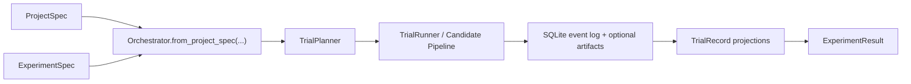

# Introduction

Themis is a typed orchestration layer for reproducible LLM evaluation. The core
idea is simple:

- author immutable configuration objects on the write side
- execute trials through protocol-based plugins
- persist append-only lifecycle events and optional artifacts
- materialize read models for inspection, reporting, and statistical comparison

## Public Surface

The current implementation centers on five concepts:

| Layer | Primary API | What it does |
| --- | --- | --- |
| Configuration | `ProjectSpec`, `ExperimentSpec`, `TrialSpec`, `RuntimeContext` | Describes what should run and what runtime-only inputs are available |
| Extension points | `PluginRegistry` | Resolves engines, extractors, metrics, judges, and hooks by name |
| Execution | `Orchestrator` | Plans trials, executes them, stores events, and materializes projections |
| Read side | `ExperimentResult` | Reads trials, timelines, comparisons, and reports from storage |
| Telemetry | `TelemetryBus`, `LangfuseCallback` | Emits runtime events and can attach external trace URLs back to stored runs |
| Operator tooling | `themis-quickcheck` | Queries SQLite summaries for failures, scores, and latency |

## Mental Model

Themis splits the system into a write side and a read side:

- Write side: plan trials, run plugins, append lifecycle events.
- Read side: hydrate immutable `TrialRecord` and `RecordTimelineView` projections.

That separation keeps retries, resume behavior, and analysis tooling predictable.

The intended public surface is the curated root package plus
`themis.errors`, `themis.specs`, `themis.runtime`, `themis.registry`, and
`themis.contracts`. Storage and orchestration internals are importable for local
inspection, but they are not the stable extension surface.

## What This Documentation Covers

This site is organized around three complementary views:

- [Concepts](../concepts/index.md) for architecture and mental models
- [Guides](../guides/index.md) for task-oriented workflows
- [API Reference](../api-reference/index.md) for source-backed class and function docs

## When Themis Fits Best

Themis is a good fit when you want:

- deterministic trial expansion from typed config
- explicit storage and resume behavior
- plugin-based inference, extraction, and scoring
- post-run inspection through timelines, reports, and paired comparisons

The current focus is local-first execution, persistence, and analysis.

The v2 execution surface also includes explicit planning and run handles:

- `plan()` snapshots the resolved run into deterministic work items
- `submit()` and `resume()` operate on persisted run manifests
- `estimate()` provides a best-effort dry run for work-item and token budgets
