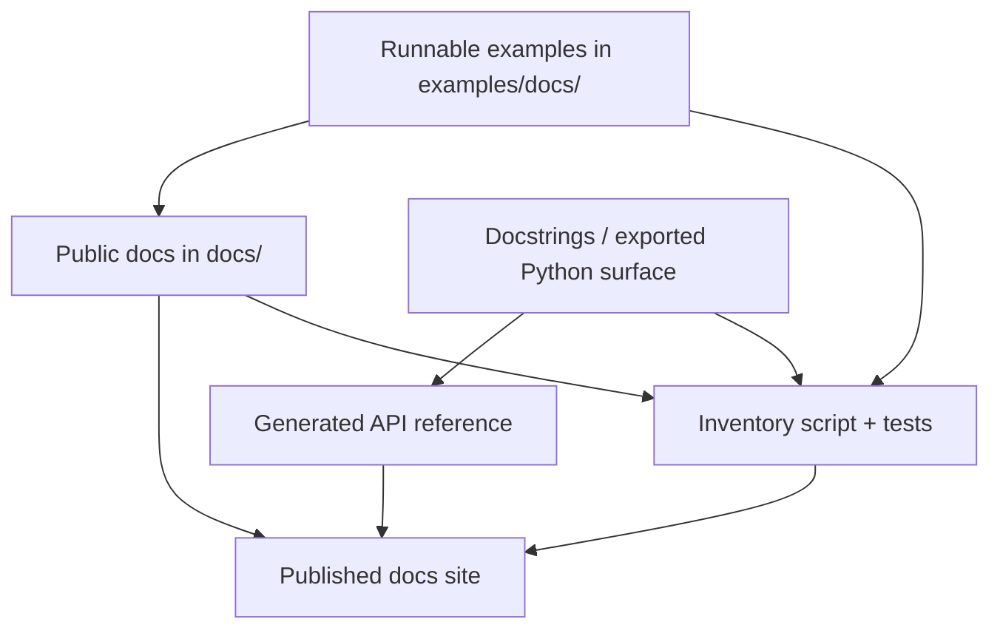

# Docs architecture

Themis docs are split into:

- public Diátaxis docs under `docs/`
- runnable example sources under `examples/docs/`
- tests that enforce docs inventory and example coverage
- generated API reference from docstrings
- the docs inventory script at `scripts/docs/build_inventory.py`

Use this source-of-truth map when you need to decide where a documentation change should actually originate.

The published site is assembled from multiple sources, so the correct fix often lives in examples, docstrings, or coverage checks rather than the page text alone.

Source-of-truth rules:

- manifests and exported Python surface define reference coverage
- examples are source-of-truth for code snippets
- project/process docs live under `docs/project/` and `CONTRIBUTING.md`
