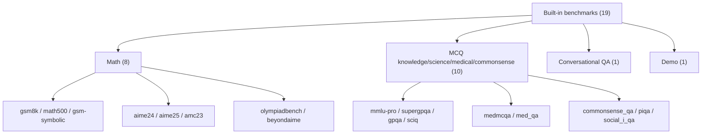
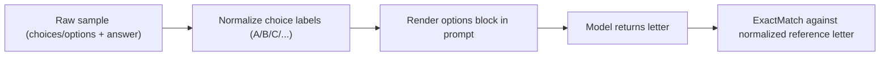

# Benchmarks Reference

Code-aligned reference for all built-in benchmark presets in Themis.

## Scope

This page is the runtime reference for:

- Built-in benchmark names
- Default metric and extractor per benchmark
- Default reference/id fields
- Dataset split behavior where it matters

For API surface details, see [Presets API](../api/presets.md).
For workflow usage, see [Evaluation Guide](../guides/evaluation.md).

## Quick Use

```python
from themis import evaluate

# Run a built-in benchmark with its preset prompt/metrics/extractor
report = evaluate("gsm8k", model="gpt-4o-mini", limit=100)
```

## Built-in Catalog

The following table reflects the preset registry in `themis/presets/benchmarks.py`.

| Benchmark | Domain | Task shape | Default metric | Default extractor | Reference field | Dataset ID field | Split/source note |
| --- | --- | --- | --- | --- | --- | --- | --- |
| `demo` | Quick sanity checks | Free-form QA | `ExactMatch` | `IdentityExtractor` | `answer` | `id` | In-memory demo dataset (3 samples) |
| `gsm8k` | Math reasoning | Free-form QA | `MathVerifyAccuracy` | `MathVerifyExtractor` | `answer` | `unique_id` | Hugging Face `test` |
| `math500` | Competition math | Free-form QA | `MathVerifyAccuracy` | `MathVerifyExtractor` | `solution` | `unique_id` | Loader default split |
| `gsm-symbolic` | Math reasoning | Free-form QA | `MathVerifyAccuracy` | `MathVerifyExtractor` | `answer` | `unique_id` | Hugging Face `test` |
| `aime24` | Contest math | Free-form QA | `MathVerifyAccuracy` | `MathVerifyExtractor` | `answer` | `unique_id` | Hugging Face `test` |
| `aime25` | Contest math | Free-form QA | `MathVerifyAccuracy` | `MathVerifyExtractor` | `answer` | `unique_id` | Hugging Face `test` |
| `amc23` | Contest math | Free-form QA | `MathVerifyAccuracy` | `MathVerifyExtractor` | `answer` | `unique_id` | Hugging Face `test` |
| `olympiadbench` | Contest math | Free-form QA | `MathVerifyAccuracy` | `MathVerifyExtractor` | `answer` | `unique_id` | Hugging Face `test` |
| `beyondaime` | Contest math | Free-form QA | `MathVerifyAccuracy` | `MathVerifyExtractor` | `answer` | `unique_id` | Hugging Face `test` |
| `mmlu-pro` | Knowledge | MCQ (letter output) | `ExactMatch` | `IdentityExtractor` | `answer` | `unique_id` | Hugging Face `test` |
| `supergpqa` | Science | MCQ (letter output) | `ExactMatch` | `IdentityExtractor` | `answer` | `unique_id` | Hugging Face `test` |
| `gpqa` | Science | MCQ (letter output) | `ExactMatch` | `IdentityExtractor` | `answer` | `unique_id` | Hugging Face `test` |
| `sciq` | Science | MCQ (letter output) | `ExactMatch` | `IdentityExtractor` | `answer` | `unique_id` | Hugging Face `test` |
| `medmcqa` | Medicine | MCQ (letter output) | `ExactMatch` | `IdentityExtractor` | `answer` | `unique_id` | Hugging Face `test` |
| `med_qa` | Medicine | MCQ (letter output) | `ExactMatch` | `IdentityExtractor` | `answer` | `unique_id` | Hugging Face `test` |
| `commonsense_qa` | Commonsense | MCQ (letter output) | `ExactMatch` | `IdentityExtractor` | `answer` | `unique_id` | Hugging Face `validation` |
| `piqa` | Commonsense | MCQ (letter output) | `ExactMatch` | `IdentityExtractor` | `answer` | `unique_id` | Hugging Face `validation` |
| `social_i_qa` | Commonsense | MCQ (letter output) | `ExactMatch` | `IdentityExtractor` | `answer` | `unique_id` | Hugging Face `validation` |
| `coqa` | Conversational QA | Free-form QA | `ExactMatch` | `IdentityExtractor` | `answer` | `unique_id` | Hugging Face `validation` |

## Family Map



## Family Index

### Math presets

`gsm8k`, `math500`, `gsm-symbolic`, `aime24`, `aime25`, `amc23`, `olympiadbench`, `beyondaime`

- Use `MathVerifyAccuracy` by default.
- Math prompt templates use question/problem style inputs and expect final answer extraction.

### MCQ presets

`mmlu-pro`, `supergpqa`, `gpqa`, `sciq`, `medmcqa`, `med_qa`, `commonsense_qa`, `piqa`, `social_i_qa`

- Use `ExactMatch` by default.
- Prompt templates explicitly ask for letter answers.

### Conversational preset

`coqa`

- Free-form QA over a passage/story context.

### Demo preset

`demo`

- Minimal local dataset for setup validation.
- No external dataset dependency.

## Shared Behavior and Gotchas

### MCQ normalization is automatic

MCQ presets normalize options and references into letter form before evaluation:

- Supports choices from `choices` or `options`
- Builds labeled options (`A`, `B`, `C`, ...)
- Normalizes reference answers to canonical letter labels

This means your model should return the letter label for best compatibility.



### Reference fields are preset-specific

- Most presets use `answer`.
- `math500` uses `solution`.

If you switch a benchmark to custom metrics or custom pipelines, ensure reference expectations still match the preset field.

### Validation split usage is intentional for some datasets

`commonsense_qa`, `piqa`, `social_i_qa`, and `coqa` use validation split in presets.

### Benchmark names are case-insensitive in lookup

Presets are registered lowercased and resolved case-insensitively.

## Practical Selection Guide

- Smoke tests: `demo`
- General math reasoning: `gsm8k`
- Hard math: `math500`
- Contest-style math: `aime24`, `aime25`, `amc23`, `olympiadbench`, `beyondaime`
- Broad knowledge/science MCQ: `mmlu-pro`, `gpqa`, `supergpqa`, `sciq`
- Medical MCQ: `medmcqa`, `med_qa`
- Commonsense MCQ: `commonsense_qa`, `piqa`, `social_i_qa`
- Conversational QA: `coqa`

## Introspection Snippet

Use runtime metadata if you want to verify defaults programmatically:

```python
from themis.presets import list_benchmarks, get_benchmark_preset

for name in list_benchmarks():
    preset = get_benchmark_preset(name)
    print(
        name,
        [type(metric).__name__ for metric in preset.metrics],
        type(preset.extractor).__name__,
        preset.reference_field,
        preset.dataset_id_field,
    )
```

## Extending with Custom Benchmarks

Register your own `BenchmarkPreset` via `register_benchmark(...)`.
See [Presets API](../api/presets.md) for the full class and registration example.

## Canonical Source

This doc intentionally avoids duplicating per-benchmark narrative sections.
If you need implementation-level truth, use:

- `themis/presets/benchmarks.py`
- `themis/datasets/` loaders referenced by each preset
