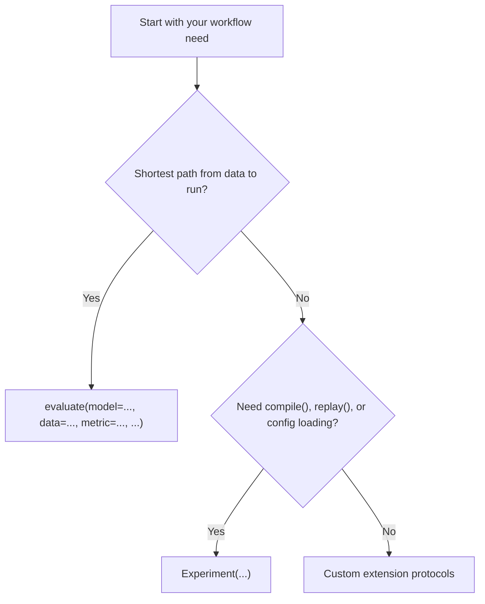

# Choose your API layer

Use `evaluate(model=..., data=..., metric=..., ...)` when you want the shortest path from a dataset and a few inline arguments to a completed run. It is best for quick scripts and quick local experiments.

Use `Experiment(...)` when you want an explicit compiled object, access to `compile()`, `run()`, `replay()`, config-file loading, or long-lived experiment definitions. This is the primary surface for most serious work.

Use custom extension protocols when builtin generators, parsers, reducers, or metrics are not sufficient and you need to plug your own behavior into the runtime.

Use this chooser when you need the smallest surface that still exposes the behavior you care about.

All three paths still converge on the same runtime model, so this choice is about authoring surface, not a different engine.

Decision rule:

- shortest path: `evaluate(model=..., data=..., metric=..., ...)`
- reusable experiment: `Experiment(...)`
- custom runtime behavior: extension protocols

Next:

- learn by example in [First `evaluate(...)`](../tutorials/first-evaluate.md)
- understand the model in [API layer model](../explanation/api-layer-model.md)
